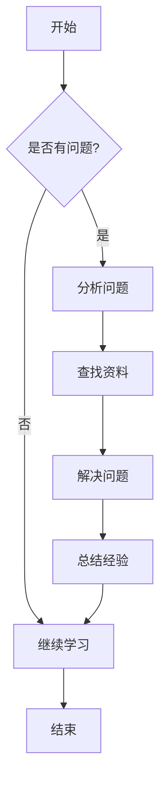
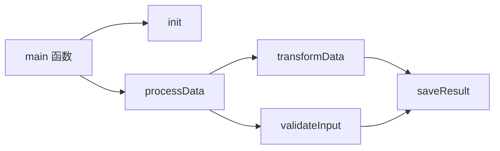
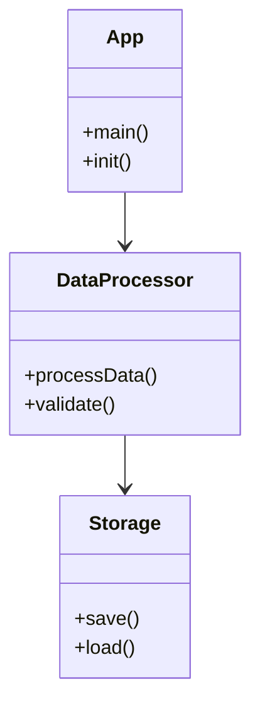

+++
title = "我的第一篇学习笔记"
description = "关于 Hugo 和 PaperMod 主题的学习"
date = 2026-03-16
draft = false
tags = ["Hugo", "PaperMod", "学习笔记"]
categories = ["技术"]
+++

# 我的第一篇学习笔记

今天开始使用 Hugo 搭建我的学习笔记网站。

## 为什么选择 Hugo？

Hugo 是一个静态网站生成器，具有以下优点：

- 构建速度快
- 主题丰富
- 易于部署到 GitHub Pages

## 下一步计划

1. 学习更多 Hugo 知识
2. 定制 PaperMod 主题
3. 写更多学习笔记

持续更新中...

## Mermaid 图表示例

Hugo PaperMod 主题内置支持 Mermaid.js，可以直接使用。

### 流程图



### 函数调用关系图



### 类图/模块关系



### 时序图

```mermaid
sequenceDiagram
    participant U as 用户
    participant H as Hugo
    participant P as PaperMod
    participant G as GitHub Pages

    U->>H: 编写 Markdown
    H->>P: 生成静态页面
    P->>G: 推送到仓库
    G->>G: 自动部署
    G-->>U: 网站上线
