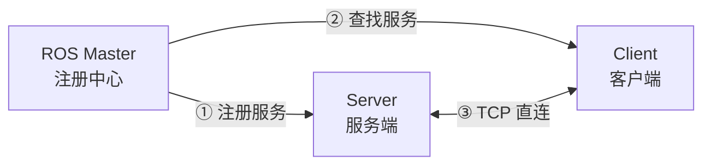
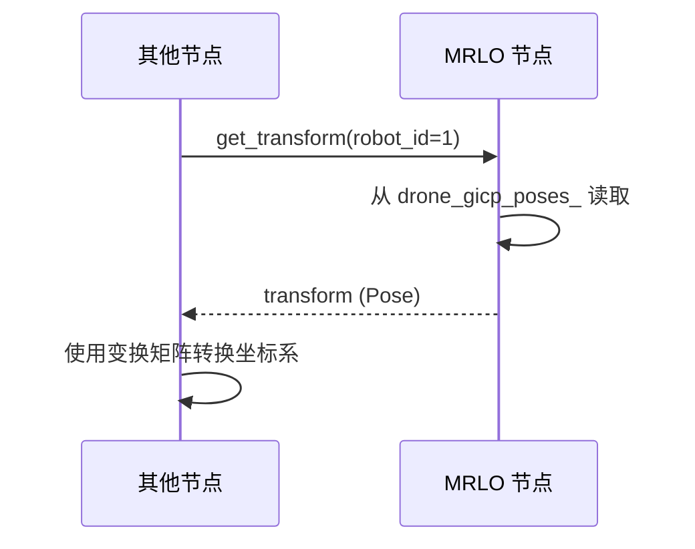

+++
title = 'ROS 服务创建与调用指南'
description = "介绍 ROS 服务的通信原理、创建步骤和调用方法，包含 C++/Python 示例"
date = '2026-06-17'
draft = false
tags = ["slam", "学习笔记"]
categories = ["ROS"]
+++

## 介绍

ROS 服务（Service）是一种**请求-响应**模式的通信机制，适合一次性查询或控制操作（区别于持续发布的 Topic）。

```
客户端 (Client)                    服务端 (Server)
     |                                  |
     |--- 请求 (Request) ------------->|
     |                                  | 处理逻辑
     |<-- 响应 (Response) -------------|
```

---

## 原理

### 通信模型

ROS 服务基于 **TCP/IP** 的同步 RPC（远程过程调用）机制：

1. **服务端**在 ROS Master 注册服务名和地址
2. **客户端**通过 ROS Master 查找服务端地址
3. 客户端与服务端建立 **TCP 直连**
4. 客户端发送请求，**阻塞等待**响应
5. 服务端处理完成后返回响应，客户端解除阻塞



### 与 Topic 的对比

| 特性 | Topic（话题） | Service（服务） |
|------|--------------|----------------|
| 通信模式 | 发布-订阅（异步） | 请求-响应（同步） |
| 是否阻塞 | 否，持续发布 | 是，等待响应 |
| 数据流向 | 单向（发布者→订阅者） | 双向（请求+响应） |
| 适用场景 | 持续数据流（传感器、位姿） | 一次性操作（查询、控制） |
| 典型例子 | 点云、里程计、地图 | 获取变换、保存文件、重置状态 |

### 底层实现

- 服务定义文件 `.srv` 编译后自动生成 C++/Python 的请求和响应类
- 通信协议：`roscpp` 使用 TCPROS，`rospy` 使用 XML-RPC + TCPROS
- 服务端回调函数在 ROS spinner 线程中执行，多个请求会排队处理

---

## 作用

### 适用场景

1. **状态查询**：获取某个变量的当前值（如本项目的变换矩阵查询）
2. **配置修改**：运行时修改参数（如切换模式、调整阈值）
3. **触发动作**：执行一次性操作（如保存地图、重置系统）
4. **同步确认**：需要确认操作结果（如配准是否成功）

### 本项目中的应用



外部节点（如导航、规划模块）需要知道各机器人相对于 robot0 的坐标变换，通过服务按需获取，避免不必要的持续订阅。

---

## 完整步骤

### 1. 定义 .srv 文件

在 `srv/` 目录下创建服务定义文件，格式为：

```
# 请求部分（--- 之上）
类型 字段名
---
# 响应部分（--- 之下）
类型 字段名
```

**示例**：`srv/GetTransform.srv`

```
# Request
int32 robot_id
---
# Response
bool success
string message
geometry_msgs/Pose transform
```

**常用类型**：`int32`, `float64`, `bool`, `string`, `geometry_msgs/Pose`, `sensor_msgs/PointCloud2`

---

### 2. 修改 CMakeLists.txt

```cmake
# ① find_package 中已包含 message_generation（通常已有）

# ② 添加服务文件
add_service_files(
  FILES
  GetTransform.srv
)

# ③ generate_messages 中确保依赖完整
generate_messages(
  DEPENDENCIES
  std_msgs
  geometry_msgs    # 如果 srv 用了 geometry_msgs 类型
)
```

---

### 3. 修改 package.xml

确认已有以下依赖（通常创建包时自动生成）：

```xml
<build_depend>message_generation</build_depend>
<exec_depend>message_runtime</exec_depend>
```

---

### 4. 服务端实现（C++）

**头文件**：

```cpp
#include <your_package/YourService.h>  // 自动生成

// 类成员
ros::ServiceServer service_server_;
bool serviceCallback(your_package::YourService::Request& req,
                     your_package::YourService::Response& res);
```

**构造函数中注册**：

```cpp
service_server_ = nh_.advertiseService("service_name",
                                        &ClassName::serviceCallback, this);
```

**回调实现**：

```cpp
bool ClassName::serviceCallback(your_package::YourService::Request& req,
                                 your_package::YourService::Response& res) {
    // 读取请求
    int id = req.robot_id;

    // 处理逻辑
    if (success) {
        res.success = true;
        res.message = "OK";
        // 填充其他响应字段...
    } else {
        res.success = false;
        res.message = "Error: xxx";
    }

    return true;  // 返回 false 会关闭服务
}
```

---

### 5. 客户端调用

#### Python 方式

```python
#!/usr/bin/env python3
import rospy
from your_package.srv import YourService

rospy.init_node('my_client')

# 等待服务上线
rospy.wait_for_service('service_name')

# 调用
try:
    proxy = rospy.ServiceProxy('service_name', YourService)
    resp = proxy(robot_id=1)  # 参数名对应 srv 中的 Request 字段

    if resp.success:
        print(resp.transform)
    else:
        print("Failed:", resp.message)
except rospy.ServiceException as e:
    print("Service call failed:", e)
```

#### C++ 方式

```cpp
#include <your_package/YourService.h>

your_package::YourService srv;
srv.request.robot_id = 1;

if (ros::service::call("service_name", srv)) {
    if (srv.response.success) {
        // 使用 srv.response.transform
    }
}
```

#### 命令行方式

```bash
# 查看服务类型
rosservice type /service_name

# 调用（自动补全参数）
rosservice call /service_name "robot_id: 1"
```

---

## 调试技巧

```bash
# 列出所有服务
rosservice list

# 查看服务类型
rosservice type /get_transform

# 查看服务详细信息（包含请求/响应字段）
rossrv show multi_robot_loop_optimization/GetTransform
```

---

## 常见问题

| 问题 | 原因 | 解决 |
|------|------|------|
| `ImportError: No module named yaml` | shebang 用了 python2 | 改为 `#!/usr/bin/env python3` |
| 服务调用超时 | 服务端未启动 | 确认 mrlo_node 已运行 |
| `rosservice call` 报参数错误 | 参数格式不对 | 用 Tab 键自动补全 |
| 编译找不到 srv 头文件 | CMakeLists 未配置 | 检查 `add_service_files` 和 `generate_messages` |

---

## 参考

- **ROS Wiki Services**：http://wiki.ros.org/Services
- **ROS Wiki Writing a Simple Service and Client (C++)**：http://wiki.ros.org/ROS/Tutorials/WritingServiceClient(c%2B%2B)
- **ROS Wiki Writing a Simple Service and Client (Python)**：http://wiki.ros.org/ROS/Tutorials/WritingServiceClient(python)
