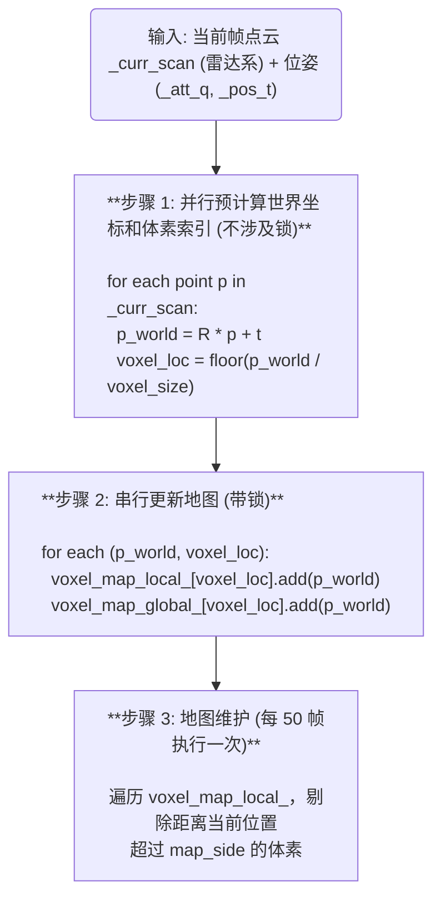

+++
title = 'LIO学习笔记04'
description = "ZLIO 系统中体素地图的核心设计：增量统计、哈希索引与点到平面观测模型"
date = '2026-06-14'
draft = false
tags = ["slam", "学习笔记"]
categories = ["SLAM"]
slug = ""
aliases = []
series = []
externalLink = ""
toc = true
math = true
+++

## 介绍

体素地图是 ZLIO 系统的核心数据结构之一，用于维护局部三维环境的紧凑表示。相比传统的 KD-Tree + 暴力搜索方案，体素地图通过**哈希表**实现 O(1) 的体素查找，并利用**点集统计量 (PointCluster)** 避免存储原始点云，大幅降低内存占用。

核心设计思想：

1. **空间离散化**：将连续的三维空间划分为固定大小的立方体（体素），每个体素由整数坐标 `(x, y, z)` 索引
2. **增量统计**：不存储原始点，而是维护每个体素内点的**一阶矩（坐标和）**和**二阶矩（坐标外积和）**，可在线计算质心和协方差
3. **平面检测**：通过协方差矩阵的特征值分解判断体素内点是否构成平面，为 IESKF 提供点到平面的观测约束

涉及的核心文件：

| 文件 | 作用 |
|------|------|
| `voxel_map_manager.h/cpp` | 体素地图数据结构与管理接口 |
| `lio_zh_voxel_model.h` | 基于体素的点到平面观测模型 |

---

## 核心数据结构

### 体素位置 VOXEL_LOC

```cpp
struct VOXEL_LOC {
  int64_t x, y, z;

  VOXEL_LOC(int64_t _x = 0, int64_t _y = 0, int64_t _z = 0)
      : x(_x), y(_y), z(_z) {}

  bool operator==(const VOXEL_LOC &other) const {
    return (x == other.x && y == other.y && z == other.z);
  }
};
```

**设计要点**：

- 使用 `int64_t` 而非 `int`，支持极大的坐标范围（避免负数取整溢出）
- 重载 `operator==` 以支持哈希表的相等比较
- 三个整数唯一确定一个体素在空间中的位置

### 哈希函数 VoxelHash

```cpp
struct VoxelHash {
  size_t operator()(const VOXEL_LOC &v) const {
    return (((v.x * 73856093) ^ (v.y * 19349663) ^ (v.z * 83492791)) % 10000000);
  }
};
```

这是一个经典的**空间哈希函数**，三个大质数分别与坐标异或后取模，将三维整数坐标映射到一维哈希值。选择大质数可以减少哈希冲突。

### 点集统计 PointCluster

```cpp
class PointCluster {
 public:
  EIGEN_MAKE_ALIGNED_OPERATOR_NEW
  Eigen::Matrix3d P = Eigen::Matrix3d::Zero(); // 二阶矩: sum(p * p^T)
  Eigen::Vector3d v = Eigen::Vector3d::Zero(); // 一阶矩: sum(p)
  int N = 0;                                   // 点数

  void add(const Eigen::Vector3d &point) {
    P += point * point.transpose();  // 累加外积
    v += point;                       // 累加坐标
    N++;
  }

  Eigen::Vector3d getCenter() const {
    return v / static_cast<double>(N);  // 质心 = 一阶矩 / 点数
  }

  Eigen::Matrix3d getCovariance() const {
    if (N < 3) return Eigen::Matrix3d::Identity();
    Eigen::Vector3d center = getCenter();
    return P / static_cast<double>(N) - center * center.transpose();
    // 协方差 = E[pp^T] - E[p]E[p]^T
  }
};
```

**核心数学原理**：

PointCluster 利用**在线算法**维护统计量，避免存储全部原始点：

| 统计量 | 公式 | 含义 |
|--------|------|------|
| 一阶矩 $v$ | $\sum_{i=1}^{N} p_i$ | 坐标之和 |
| 二阶矩 $P$ | $\sum_{i=1}^{N} p_i p_i^T$ | 外积之和 |
| 质心 $\bar{p}$ | $v / N$ | 几何中心 |
| 协方差 $\Sigma$ | $P/N - \bar{p}\bar{p}^T$ | 分散程度 |

**增量更新**：每来一个新点，只需执行一次向量加法和一次矩阵加法，无需回溯历史数据。这使得 `add()` 操作的时间复杂度为 O(1)。

**为什么不用存储原始点？**

在 IESKF 更新步中，我们只需要：
1. 体素的**质心**（用于计算点到平面距离）
2. 体素的**协方差矩阵**（用于判断是否为平面、提取法向量）

这两个量都可以从 `PointCluster` 的三个统计量 `(N, v, P)` 直接计算得到。

### 体素地图管理器 VoxelMapManager

```cpp
class VoxelMapManager : public ModuleBase {
 public:
  using Ptr = std::shared_ptr<VoxelMapManager>;

  void reset();
  void addScan(PCLPointCloudPtr _curr_scan,
               const Eigen::Quaterniond &_att_q,
               const Eigen::Vector3d &_pos_t);

  void saveMapPCD(const std::string &_file_path);    // 保存质心 PCD
  void saveMapBinary(const std::string &_file_path); // 保存二进制格式

 private:
  // 局部地图：用于 IESKF 跟踪，会自动清理远离当前位置的体素
  std::unordered_map<VOXEL_LOC, PointCluster, VoxelHash> voxel_map_local_;

  // 全局地图：用于保存，只增不减
  std::unordered_map<VOXEL_LOC, PointCluster, VoxelHash> voxel_map_global_;

  mutable std::mutex mtx_map_;

  double voxel_size_ = 0.5;  // 体素大小 (m)
  double map_side_ = 50.0;   // 局部地图维护范围 (m)
};
```

**双地图设计**：

| 地图 | 用途 | 特点 |
|------|------|------|
| `voxel_map_local_` | IESKF 跟踪的局部地图 | 会定期清理远离当前位姿的体素，控制内存 |
| `voxel_map_global_` | 完整地图保存 | 只增不减，用于最终地图导出 |

---

## 体素索引原理

将世界坐标转换为体素整数坐标的公式：

$$voxel\_x = \lfloor \frac{p_x}{voxel\_size} \rfloor, \quad voxel\_y = \lfloor \frac{p_y}{voxel\_size} \rfloor, \quad voxel\_z = \lfloor \frac{p_z}{voxel\_size} \rfloor$$

其中 $\lfloor \cdot \rfloor$ 表示向下取整。

```
示意图 (2D 视角, voxel_size = 1.0):

  y
  3 ┌───┬───┬───┬───┐
    │   │   │   │   │
  2 ├───┼───┼───┼───┤
    │   │ ● │   │   │   ● = 点 (1.3, 2.7)
  1 ├───┼───┼───┼───┤     体素索引 = (⌊1.3/1⌋, ⌊2.7/1⌋) = (1, 2)
    │   │   │   │   │
  0 ├───┼───┼───┼───┤
    0   1   2   3   4  x
```

**代码实现**：

```cpp
VOXEL_LOC loc(
    static_cast<int64_t>(std::floor(world_point.x() / voxel_size_)),
    static_cast<int64_t>(std::floor(world_point.y() / voxel_size_)),
    static_cast<int64_t>(std::floor(world_point.z() / voxel_size_))
);
```

`std::floor` 保证负坐标也能正确映射（例如 `-0.3` 会映射到 `-1` 而非 `0`）。

---

## 地图构建流程

### addScan 整体流程



### 代码实现

[voxel_map_manager.cpp:addScan()](src/zlio/src/core/modules/voxel_map_manager.cpp#L34-L82)：

```cpp
void VoxelMapManager::addScan(PCLPointCloudPtr _curr_scan,
                               const Eigen::Quaterniond &_att_q,
                               const Eigen::Vector3d &_pos_t) {
  if (_curr_scan->empty()) return;

  int cloud_size = _curr_scan->size();
  std::vector<Eigen::Vector3d> world_points(cloud_size);
  std::vector<VOXEL_LOC> voxel_locs(cloud_size);

  Eigen::Isometry3d transform = Eigen::Isometry3d::Identity();
  transform.rotate(_att_q);
  transform.pretranslate(_pos_t);

  // ===== 步骤 1: 并行预计算 (只读，无锁) =====
#ifdef MP_EN
  omp_set_num_threads(MP_PROC_NUM);
#pragma omp parallel for
#endif
  for (int i = 0; i < cloud_size; i++) {
    const auto &p = _curr_scan->points[i];
    world_points[i] = transform * Eigen::Vector3d(p.x, p.y, p.z);
    voxel_locs[i] = VOXEL_LOC(
        static_cast<int64_t>(std::floor(world_points[i].x() / voxel_size_)),
        static_cast<int64_t>(std::floor(world_points[i].y() / voxel_size_)),
        static_cast<int64_t>(std::floor(world_points[i].z() / voxel_size_)));
  }

  // ===== 步骤 2: 串行更新地图 (写操作，加锁) =====
  {
    std::lock_guard<std::mutex> lock(mtx_map_);
    for (int i = 0; i < cloud_size; i++) {
      voxel_map_local_[voxel_locs[i]].add(world_points[i]);
      voxel_map_global_[voxel_locs[i]].add(world_points[i]);
    }

    // ===== 步骤 3: 定期清理局部地图 =====
    static int cleanup_counter = 0;
    if (map_side_ > 0 && ++cleanup_counter > 50) {
      cleanup_counter = 0;
      for (auto it = voxel_map_local_.begin(); it != voxel_map_local_.end(); ) {
        const auto &loc = it->first;
        Eigen::Vector3d v_pos(loc.x * voxel_size_, loc.y * voxel_size_, loc.z * voxel_size_);
        if ((v_pos - _pos_t).cwiseAbs().maxCoeff() > map_side_) {
          it = voxel_map_local_.erase(it);
        } else {
          ++it;
        }
      }
    }
  }
}
```

**并行策略分析**：

| 步骤 | 并行化 | 原因 |
|------|--------|------|
| 世界坐标计算 + 体素索引 | ✅ OpenMP 并行 | 每个点独立计算，无数据竞争 |
| 哈希表更新 | ❌ 串行 | `unordered_map` 的写操作非线程安全 |
| 地图清理 | ❌ 串行 | 需要遍历 + 删除，与更新共享锁 |

---

## 地图维护策略

局部地图采用**滑动窗口**策略，每 50 帧执行一次清理：

```cpp
// 清理条件：体素中心到当前位置的 L∞ 距离 > map_side
(v_pos - _pos_t).cwiseAbs().maxCoeff() > map_side_
```

**为什么用 L∞ 距离（切比雪夫距离）而不是 L2（欧氏距离）？**

- L∞ 距离等价于判断体素是否在一个**立方体窗口**内
- 计算只需 `max(abs(dx), abs(dy), abs(dz))`，比 `sqrt(dx²+dy²+dz²)` 更快
- 体素本身就是立方体，用立方体窗口更自然

```
维护范围示意 (2D 视角):

          map_side = 50m
         ◄─────────────►
    ┌────────────────────────────┐
    │                            │
    │    ┌──────────────────┐    │
    │    │                  │    │
    │    │    ● 当前位置     │    │
    │    │                  │    │
    │    └──────────────────┘    │
    │     保留范围 (100m×100m)    │
    │                            │
    └────────────────────────────┘
           超出范围的体素被删除
```

**设计权衡**：

| 参数 | 值 | 影响 |
|------|-----|------|
| `voxel_size = 0.5m` | 较小 | 更精细的地图表示，但体素数量更多 |
| `map_side = 50m` | 中等 | 保留 100m×100m 范围，平衡精度与内存 |
| 清理周期 = 50 帧 | 较长 | 减少清理开销，但可能短暂保留过期体素 |

---

## 观测模型：点到平面残差

### 平面拟合原理

对于一个体素内的点集，其协方差矩阵为：

$$\Sigma = \frac{1}{N}\sum_{i=1}^{N}(p_i - \bar{p})(p_i - \bar{p})^T = \frac{P}{N} - \bar{p}\bar{p}^T$$

对 $\Sigma$ 进行特征值分解：

$$\Sigma = U \cdot \text{diag}(\lambda_0, \lambda_1, \lambda_2) \cdot U^T, \quad \lambda_0 \leq \lambda_1 \leq \lambda_2$$

**平面判定条件**：

$$\lambda_0 < 0.01 \quad \text{且} \quad \lambda_0 < 0.1 \cdot \lambda_1$$

- $\lambda_0 \approx 0$：点集在一个方向上几乎没有分散，说明是平面
- $\lambda_0 \ll \lambda_1$：最小特征值远小于次小特征值，平面性好

对应的**法向量**为最小特征值对应的特征向量 $n = U[:,0]$。

```
特征值分解示意:

  λ₂ (最大) ─── 沿平面的最大分散方向
  λ₁ (中间) ─── 沿平面的次大分散方向
  λ₀ (最小) ─── 垂直于平面的方向 (法向量方向)

  如果 λ₀ ≈ 0，则点集近似共面:

       λ₁ 方向
         ↑
         │  • • •
         │• • • • •    → λ₂ 方向
         │  • • •
         │
         (平面)
```

### 点到平面距离

对于一个世界系下的点 $p_w$，到平面 $(n, c)$ 的距离为：

$$d = n^T \cdot (p_w - c)$$

其中：

- $n$：平面法向量（单位向量）
- $c$：平面质心
- $p_w = R \cdot p_{imu} + t$：点从 IMU 系变换到世界系

**残差** $z = d$，当点恰好在平面上时 $z = 0$。

### 雅可比矩阵推导

IESKF 更新需要观测方程对状态的雅可比 $H$。状态为 18 维 $(\delta\theta, \delta p, \delta v, \delta b_g, \delta b_a, \delta g)$，但观测只与旋转和位置有关：

$$z = n^T \cdot (R \cdot p_{imu} + t - c)$$

对旋转误差 $\delta\theta$（使用一阶近似 $R \approx R_0 \cdot (I + [\delta\theta]_\times)$）：

$$\frac{\partial z}{\partial \delta\theta} = n^T \cdot R_0 \cdot [p_{imu}]_\times \cdot (-1) = -n^T \cdot R_0 \cdot [p_{imu}]_\times$$

对位置误差 $\delta p$：

$$\frac{\partial z}{\partial \delta p} = n^T$$

因此雅可比矩阵 $H$ 的一行：

$$H_i = \begin{bmatrix} -n^T R [p_{imu}]_\times & n^T & 0_{1\times3} & 0_{1\times3} & 0_{1\times3} & 0_{1\times3} \end{bmatrix}$$

**推导细节**：

$$z(\delta\theta, \delta p) = n^T \cdot (R_0(I + [\delta\theta]_\times) \cdot p_{imu} + t + \delta p - c)$$

$$\approx n^T \cdot (R_0 \cdot p_{imu} + t - c) + n^T \cdot R_0 [\delta\theta]_\times p_{imu} + n^T \cdot \delta p$$

利用 $[a]_\times b = -[b]_\times a$：

$$n^T R_0 [\delta\theta]_\times p_{imu} = n^T R_0 (-[p_{imu}]_\times \delta\theta) = -n^T R_0 [p_{imu}]_\times \delta\theta$$

所以：

$$H_{\delta\theta} = -n^T R_0 [p_{imu}]_\times, \quad H_{\delta p} = n^T$$

### LIOZHVoxelModel 代码实现

[lio_zh_voxel_model.h](src/zlio/include/core/modules/lio_zh_voxel_model.h) 中的 `calculate()` 方法实现了完整的观测模型：

```cpp
bool calculate(const State18 &_state, Eigen::MatrixXd &_Z, Eigen::MatrixXd &_H) override {
  int cloud_size = current_cloud_ptr_->size();

  // ===== 步骤 1: 预计算每个点对应的体素位置 =====
  std::vector<VOXEL_LOC> point_voxel_locs(cloud_size);
  std::unordered_map<VOXEL_LOC, int, VoxelHash> unique_voxels;

  for (int i = 0; i < cloud_size; i++) {
    const auto &p_imu_pcl = current_cloud_ptr_->points[i];
    Eigen::Vector3d p_world = _state.rotation * Eigen::Vector3d(p_imu_pcl.x, p_imu_pcl.y, p_imu_pcl.z)
                            + _state.position;

    VOXEL_LOC loc(static_cast<int64_t>(std::floor(p_world.x() / voxel_size_)),
                  static_cast<int64_t>(std::floor(p_world.y() / voxel_size_)),
                  static_cast<int64_t>(std::floor(p_world.z() / voxel_size_)));
    point_voxel_locs[i] = loc;
    unique_voxels[loc] = -1;  // 占位
  }

  // ===== 步骤 2: 提取唯一体素，计算平面参数 (并行) =====
  struct VoxelPlane {
    Eigen::Vector3d normal;
    Eigen::Vector3d center;
    bool is_valid = false;
  };
  std::vector<VOXEL_LOC> active_v_list;
  for (auto &kv : unique_voxels) {
    kv.second = active_v_list.size();
    active_v_list.push_back(kv.first);
  }
  std::vector<VoxelPlane> active_planes(active_v_list.size());

#ifdef MP_EN
  omp_set_num_threads(MP_PROC_NUM);
#pragma omp parallel for
#endif
  for (int i = 0; i < (int)active_v_list.size(); i++) {
    auto it = voxel_map_ptr_->find(active_v_list[i]);
    if (it != voxel_map_ptr_->end() && it->second.N >= 5) {
      const auto &cluster = it->second;
      Eigen::Matrix3d cov = cluster.getCovariance();
      Eigen::SelfAdjointEigenSolver<Eigen::Matrix3d> saes(cov);
      Eigen::Vector3d eigen_values = saes.eigenvalues();

      // 平面判定: 最小特征值 < 0.01 且 < 0.1 * 次小特征值
      if (eigen_values[0] < 0.01 && eigen_values[0] < 0.1 * eigen_values[1]) {
        active_planes[i].normal = saes.eigenvectors().col(0);  // 最小特征值对应法向量
        active_planes[i].center = cluster.getCenter();
        active_planes[i].is_valid = true;
      }
    }
  }

  // ===== 步骤 3: 并行计算残差 =====
  int valid_points_num = 0;
  std::vector<LossInfo> losses(cloud_size);
  std::vector<bool> is_effect_point(cloud_size, false);

#ifdef MP_EN
#pragma omp parallel for reduction(+:valid_points_num)
#endif
  for (int i = 0; i < cloud_size; i++) {
    int v_idx = unique_voxels.at(point_voxel_locs[i]);
    const auto &vp = active_planes[v_idx];

    if (vp.is_valid) {
      const auto &p_imu_pcl = current_cloud_ptr_->points[i];
      Eigen::Vector3d p_imu(p_imu_pcl.x, p_imu_pcl.y, p_imu_pcl.z);
      Eigen::Vector3d p_world = _state.rotation * p_imu + _state.position;

      double residual = vp.normal.dot(p_world - vp.center);  // 点到平面距离
      if (std::abs(residual) < 0.5) {  // 残差阈值: 0.5m
        losses[i] = {p_imu, vp.normal, residual};
        is_effect_point[i] = true;
        valid_points_num++;
      }
    }
  }

  if (valid_points_num < 10) return false;  // 有效点太少，跳过更新

  // ===== 步骤 4: 构建 H 和 Z 矩阵 =====
  _H = Eigen::MatrixXd::Zero(valid_points_num, 18);
  _Z = Eigen::MatrixXd::Zero(valid_points_num, 1);

  int vi = 0;
  auto R_mat = _state.rotation.toRotationMatrix();
  for (int i = 0; i < cloud_size; i++) {
    if (is_effect_point[i]) {
      const auto &loss = losses[i];
      // H 的旋转部分: -n^T * R * [p_imu]×
      _H.block<1, 3>(vi, 0) = -loss.normal.transpose() * R_mat * skewSymmetric(loss.p_imu);
      // H 的位置部分: n^T
      _H.block<1, 3>(vi, 3) = loss.normal.transpose();
      // 残差
      _Z(vi, 0) = loss.residual;
      vi++;
    }
  }

  return true;
}
```

**优化技巧**：

| 优化点 | 做法 | 效果 |
|--------|------|------|
| 唯一体素去重 | 先收集 `unique_voxels`，避免重复计算平面 | 体素数远小于点数 |
| 平面参数并行计算 | 对唯一体素列表做 `#pragma omp parallel for` | 多核加速 |
| 残差并行计算 | `#pragma omp parallel for reduction(+:valid_points_num)` | 多核加速 |
| 残差阈值过滤 | `abs(residual) < 0.5` | 剔除异常匹配 |
| 有效点数检查 | `valid_points_num < 10` | 避免病态更新 |

---

## 地图保存

### 策略 A：质心 PCD

```cpp
void VoxelMapManager::saveMapPCD(const std::string &_file_path) {
  PCLPointCloudPtr cloud(new PCLPointCloud());
  cloud->reserve(voxel_map_global_.size());

  for (auto const& [loc, cluster] : voxel_map_global_) {
    if (cluster.N < 3) continue;
    PointType pt;
    Eigen::Vector3d center = cluster.getCenter();
    pt.x = center.x(); pt.y = center.y(); pt.z = center.z();
    pt.intensity = 100;
    cloud->push_back(pt);
  }

  pcl::io::savePCDFileBinaryCompressed(_file_path, *cloud);
}
```

每个体素保存为一个点（质心位置），输出文件可用 PCL 工具或 CloudCompare 查看。

### 策略 B：自定义二进制

```cpp
void VoxelMapManager::saveMapBinary(const std::string &_file_path) {
  std::ofstream outfile(_file_path, std::ios::binary);

  size_t map_size = voxel_map_global_.size();
  outfile.write(reinterpret_cast<const char*>(&map_size), sizeof(size_t));

  for (auto const& [loc, cluster] : voxel_map_global_) {
    outfile.write(reinterpret_cast<const char*>(&loc), sizeof(VOXEL_LOC));       // 16 bytes
    outfile.write(reinterpret_cast<const char*>(&cluster.N), sizeof(int));        // 4 bytes
    outfile.write(reinterpret_cast<const char*>(cluster.v.data()), sizeof(double) * 3);  // 24 bytes
    outfile.write(reinterpret_cast<const char*>(cluster.P.data()), sizeof(double) * 9);  // 72 bytes
  }
}
```

二进制格式保留了完整的统计量 `(VOXEL_LOC, N, v, P)`，可用于后续加载和进一步处理。每个体素占 116 bytes。

---

## 与 VoxelSLAM 参考实现的对比

| 特性 | ZLIO (VoxelMapManager) | VoxelSLAM (OctoTree) |
|------|------------------------|----------------------|
| 数据结构 | `unordered_map<VOXEL_LOC, PointCluster>` | `unordered_map<VOXEL_LOC, OctoTree*>` |
| 空间组织 | 扁平哈希表，单层体素 | 八叉树，支持多层细分 |
| 平面检测 | 特征值分解 (运行时) | 特征值分解 (维护时) |
| 存储方式 | 增量统计量 (N, v, P) | 原始点 + 统计量 |
| 滑动窗口 | 无，直接清理远距离体素 | OctoTree 内部 SlideWindow |
| 观测模型 | 点到平面 (IESKF) | 点到平面 (BA 优化) |
| 多帧优化 | 单帧 IESKF | 滑动窗口 BA |
| 内存占用 | 较低 (仅统计量) | 较高 (存储原始点) |
| 实现复杂度 | 简单 | 复杂 (八叉树管理) |

**ZLIO 的简化设计**：

VoxelSLAM 的 `OctoTree` 是一个完整的八叉树实现，支持：

- 多层细分（`max_layer` 控制）
- 滑动窗口优化（`SlideWindow`）
- 平面不确定性传播（`plane_var`）
- LM 优化器（`Lidar_BA_Optimizer`）

ZLIO 选择了一个更简洁的方案：单层体素 + IESKF 滤波，牺牲了一些精度换取了实现的简洁性和计算效率。

---

## 完整数据流

```
┌─────────────────────────────────────────────────────────────────────┐
│                        FrontEnd::track()                             │
│                                                                      │
│  ┌───────────────────────────────────────────┐                      │
│  │ imu_process_ptr_->propagate(mg, ieskf)    │ ← 前向传播 + 去畸变  │
│  └───────────────────────────────────────────┘                      │
│                                                                      │
│  ┌───────────────────────────────────────────┐                      │
│  │ 第一帧?                                    │                      │
│  │   Yes → addScan(cloud, R, p) 初始化地图     │                      │
│  │   No  → 进入 IESKF 更新流程                 │                      │
│  └───────────────────────────────────────────┘                      │
│                                                                      │
│  ┌───────────────────────────────────────────┐                      │
│  │ lio_model_ptr_->setData(cloud, voxel_map)  │ ← 设置观测数据源    │
│  └───────────────────────────────────────────┘                      │
│                                                                      │
│  ┌───────────────────────────────────────────┐                      │
│  │ ieskf_ptr_->update()                       │                      │
│  │   │                                        │                      │
│  │   ├─ for iter = 1 to iter_times:           │                      │
│  │   │   ├─ calc_zh_ptr_->calculate(state,Z,H)│                      │
│  │   │   │   ├─ 遍历点云，查找对应体素         │                      │
│  │   │   │   ├─ 特征值分解，判断平面           │                      │
│  │   │   │   ├─ 计算点到平面残差               │                      │
│  │   │   │   └─ 构建 H 和 Z 矩阵              │                      │
│  │   │   ├─ 计算卡尔曼增益 K                   │                      │
│  │   │   ├─ 计算状态增量                       │                      │
│  │   │   └─ 收敛判断                           │                      │
│  │   └─ 更新协方差 P                          │                      │
│  └───────────────────────────────────────────┘                      │
│                                                                      │
│  ┌───────────────────────────────────────────┐                      │
│  │ addScan(cloud, R, p) 更新地图               │ ← 每帧都更新        │
│  │   ├─ 并行: 世界坐标 + 体素索引              │                      │
│  │   ├─ 串行: 哈希表写入 (local + global)      │                      │
│  │   └─ 定期: 清理远离的体素 (仅 local)         │                      │
│  └───────────────────────────────────────────┘                      │
└─────────────────────────────────────────────────────────────────────┘
```

### 关键设计总结

| 设计点 | 选择 | 原因 |
|--------|------|------|
| 哈希表 vs KD-Tree | 哈希表 | O(1) 查找，适合体素索引场景 |
| 增量统计 vs 存原始点 | 增量统计 | 内存 O(体素数) 而非 O(点数) |
| 双地图 | local + global | 局部地图控制内存，全局地图保留完整数据 |
| 平面检测 | 特征值分解 | 通用、鲁棒，可同时获取法向量 |
| 观测模型 | 点到平面 | 比点到点更鲁棒，适合平面环境 |
| 并行策略 | 预计算并行 + 更新串行 | 平衡性能与线程安全 |

---

## 参考

- **FAST-LIO 源码**：https://github.com/hku-mars/FAST_LIO
- **VoxelSLAM 论文**：Voxel-SLAM: A Complete, Accurate, and Versatile LiDAR-Inertial SLAM System
- **IESKF 理论**：Iterated Extended Kalman Filter for SLAM
- **PCL 点云库**：https://pointclouds.org/
