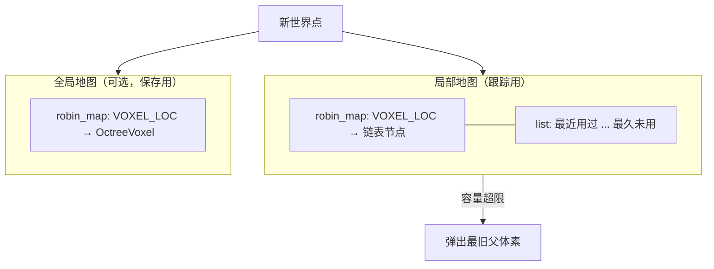

+++
title = 'LIO学习笔记04'
description = "从零理解 ZLIO 体素地图：空间划分、八叉代表点、哈希索引、LRU 局部地图与近邻查询"
date = '2026-08-10'
draft = false
tags = ["slam", "学习笔记", "雷达"]
categories = ["SLAM"]
slug = ""
aliases = []
series = []
externalLink = ""
toc = true
math = true
+++

## 介绍

激光雷达惯性里程计（LIO）一边估计机器人位姿，一边维护一份周围环境的三维地图。下一帧点云到来时，系统要把当前点「对」到地图上的局部几何上，才能算出位姿误差并修正。

ZLIO 的地图不是把每一帧原始点都存下来，而是用 **体素地图（Voxel Map）**：把三维空间切成许多小立方体，每个立方体只保留少量 **代表点**。这样既能描述墙面、地面等结构，又能控制内存和查询时间。

本文只讲体素地图本身怎么设计，尽量用新学 SLAM 也能跟上的方式说明：

1. 为什么要用体素，而不是存全部点或建一棵大 KD-Tree
2. 点如何映射到父体素、再落到八个子体素
3. 代表点如何增量更新
4. 哈希表如何实现「几乎常数时间」查找
5. 局部 LRU 地图和全局保存地图分别干什么
6. 查询时如何在邻域里找最近的代表点

核心代码在 `voxel_map_manager.h/cpp` 与 `hknn_search_table.h`。

## 体素地图要解决什么问题

想象机器人走过一条走廊。每秒可能收到数十万个激光点。若全部保留：

- 内存很快爆炸
- 每次找「这个点附近的地图点」都要在海量点里搜索，实时性很难保证

常见折中有两类：

| 方案 | 思路 | 代价 |
| ---- | ---- | ---- |
| KD-Tree / ikd-Tree | 存点，用树加速近邻搜索 | 动态插入、平衡、内存仍与点数强相关 |
| 体素地图 | 空间分格，格内压缩成统计量或代表点 | 损失部分细节，但查找可走「先定位格子再查邻域」 |

ZLIO 选后者：先把点丢进格子，格子里只留代表点；查询时先根据坐标算出所在格子，再按固定顺序扫周围格子里的代表点。

可以把体素想成三维版的「像素」：图像用像素离散化二维平面，体素用地图格子离散化三维空间。

## 空间如何划分

### 父体素

设父体素边长为 $s$（配置项 `voxel_size`，默认 $0.5\,\mathrm{m}$）。对世界坐标系下的点 $p=(p_x,p_y,p_z)$，父体素整数索引为：

$$
(x, y, z) = \left\lfloor \frac{p_x}{s} \right\rfloor,\;
\left\lfloor \frac{p_y}{s} \right\rfloor,\;
\left\lfloor \frac{p_z}{s} \right\rfloor
$$

例如 $s=0.5$，点 $(1.2,\;-0.3,\;0.8)$ 落在：

$$
\left\lfloor 1.2/0.5 \right\rfloor=2,\;
\left\lfloor -0.3/0.5 \right\rfloor=-1,\;
\left\lfloor 0.8/0.5 \right\rfloor=1
$$

也就是索引 `(2, -1, 1)`。注意负数也要用向下取整（`floor`），这样每个点唯一对应一个格子，不会在边界上「跳格」混乱。

代码里用结构体表示：

```cpp
struct VOXEL_LOC {
  int64_t x = 0;
  int64_t y = 0;
  int64_t z = 0;
};
```

使用 `int64_t` 是为了在大范围场景（室外长距离）里坐标不会轻易溢出。

### 为什么还要子体素

如果每个父体素只存 **一个** 点，墙角、细柱这类局部结构会被抹平：半米见方里可能同时有地面和墙面，一个点很难说清几何。

因此 ZLIO 在每个父体素内部再切一刀，分成 **8 个更小的立方体**（边长 $s/2$）。这就是一层八叉划分：

```text
        父体素边长 s
   ┌───────────┬───────────┐
   │  子体素   │  子体素   │
   │           │           │  边长 s/2
   ├───────────┼───────────┤
   │  子体素   │  子体素   │
   └───────────┴───────────┘
   （三维上还有上下一层，共 8 个）
```

每个子体素最多维护 **一个代表点**。于是一个父体素最多有 8 个空间位置不同的采样，比「一格一点」更能保留局部形状，又远少于存原始点。

### 子体素编号 0～7

先求父体素左下角原点（世界坐标）：

$$
o = (x\cdot s,\; y\cdot s,\; z\cdot s)
$$

再看点相对原点是否越过半边长 $s/2$，得到三个 0/1 标志 `dx, dy, dz`，编码为：

```cpp
index = (dz << 2) | (dy << 1) | dx;  // 结果在 0～7
```

| dz | dy | dx | 索引 |
| -- | -- | -- | ---- |
| 0 | 0 | 0 | 0 |
| 0 | 0 | 1 | 1 |
| 0 | 1 | 0 | 2 |
| 0 | 1 | 1 | 3 |
| 1 | 0 | 0 | 4 |
| 1 | 0 | 1 | 5 |
| 1 | 1 | 0 | 6 |
| 1 | 1 | 1 | 7 |

同一父体素里，不同子区域的点会进不同槽位，互不覆盖。

## 代表点如何更新

子体素数据结构很简单：

```cpp
struct SubVoxel {
  Eigen::Vector3d representative; // 代表点坐标
  uint16_t count;                 // 已经参与平均的点数
};
```

新点进来时按下面规则处理（默认 `max_points_per_subvoxel=20`，`max_update_distance=0.1`）：

| 情况 | 行为 | 直观理解 |
| ---- | ---- | -------- |
| 该子体素还是空的 | 代表点 = 新点，`count=1` | 第一次见到这个格子 |
| 已有点数达到上限 | 丢弃新点 | 防止无限平均、也限制计算量 |
| 新点离当前代表点太远 | 丢弃新点 | 避免把离群点平均进代表点 |
| 否则 | 做增量均值，`count++` | 用更多点把代表点估得更稳 |

增量均值公式：

$$
\mathrm{rep}_{\text{new}} = \frac{\mathrm{rep}_{\text{old}}\cdot n + p}{n+1}
$$

这和「把所有历史点加起来再除以个数」数学上等价，但只占一个点和一个计数器的内存。

整棵父体素对应：

```cpp
class OctreeVoxel {
  std::array<SubVoxel, 8> subvoxels_;
};
```

插入路径可以记成：

```text
世界点 p
  → 算父体素 (x,y,z)
  → 算子体素 index ∈ [0,7]
  → 按规则更新该槽位的代表点
```

## 用哈希表管理体素

三维空间可能非常大，不可能开一个巨型三维数组。ZLIO 只为 **真正出现过点的格子** 建条目，键是 `VOXEL_LOC`，值是 `OctreeVoxel`。

### 哈希函数

把三个整数混成一个 `size_t`，供哈希表桶定位：

```cpp
struct VoxelHash {
  size_t operator()(const VOXEL_LOC &_voxel) const {
    size_t hash = static_cast<size_t>(_voxel.x);
    hash ^= static_cast<size_t>(_voxel.y) * 0x9e3779b9U + (hash << 6U) + (hash >> 2U);
    hash ^= static_cast<size_t>(_voxel.z) * 0x85ebca6bU + (hash << 6U) + (hash >> 2U);
    return hash;
  }
};
```

查找某个格子时：算哈希 → 进对应桶 → 比对 `VOXEL_LOC` 是否相等。平均接近 O(1)。

### 为什么用 robin_map

实现上使用 `tsl::robin_map`（一种开寻址哈希表），在占用率较高时仍能保持较好的缓存局部性与查找速度，适合「体素数很多、频繁插入查询」的地图场景。

## 局部地图与全局地图

跟踪时其实不需要全世界的历史：机器人当前附近的结构更重要。因此 ZLIO 维护两套地图：

| | 局部地图 | 全局地图 |
| -- | -------- | -------- |
| 用途 | 实时近邻查询、位姿跟踪 | 结束时导出完整地图 |
| 是否淘汰 | 会 | 不会 |
| 能否关闭 | 始终需要 | `keep_global_map=false` 可关 |

### LRU：容量满了淘汰谁

局部地图有容量上限 `map_capacity`（默认 100 万个父体素）。超过后要删旧的，策略是 **LRU（Least Recently Used，最近最少使用）**：

- 用双向链表记下父体素的访问顺序
- 新插入或再次写入的格子，移到链表头部（表示最近用过）
- 容量超限时，从链表尾部删掉最久没用过的格子

直观理解：机器人往前走，身后很久没再碰到的格子会被丢掉；眼前正在用的格子会留在表头。这比「按固定半径裁剪」更直接地卡死内存上限。

结构关系可以画成：


```mermaid
flowchart TB
  subgraph Local["局部地图（跟踪用）"]
    H[robin_map: VOXEL_LOC → 链表节点]
    L[list: 最近用过 ... 最久未用]
    H --- L
  end
  subgraph Global["全局地图（可选，保存用）"]
    G[robin_map: VOXEL_LOC → OctreeVoxel]
  end
  P[新世界点] --> Local
  P --> Global
  Local -->|容量超限| E[弹出最旧父体素]
```

## 一帧点云如何写入地图

上层会调用：

```cpp
map_manager->addScan(cloud_imu, rotation, position);
```

这里的点云一般是 **IMU / 机体坐标系**下、已经去过畸变的点。写入前要先变到世界系：

$$
p_w = R\, p_{\text{imu}} + t
$$

然后对每个有效点：

1. `pointToVoxel` 得到父体素
2. `pointToSubVoxel` 得到子体素编号
3. `addLocalPoint` 更新局部 LRU 地图
4. 若开启全局地图，再 `addGlobalPoint` 写一份不受 LRU 影响的副本

伪流程：

```text
for 每个点 p_imu:
  if 坐标非法: continue
  p_w = R * p_imu + t
  loc = floor(p_w / voxel_size)
  sub = 子体素编号(p_w, loc)
  更新局部地图(loc, sub, p_w)   // 可能触发 LRU 淘汰
  if keep_global_map:
    更新全局地图(loc, sub, p_w)
```

注意：跟踪查询只读 **局部地图**。全局地图是为了事后保存完整结果，不参与实时近邻搜索。

## 如何在地图里找近邻

观测模型需要：给定当前点的世界坐标，找出地图上最近的若干代表点，用来拟合局部小平面。ZLIO 在局部地图上做 **固定顺序的近似 K 近邻搜索**（代码里简称 HKNN），默认最多返回 5 个点。

### 为什么不能只查「当前格子」

点常常落在格子边界附近。真正最近的代表点可能在隔壁父体素，甚至隔壁的隔壁。若只看当前格子里最多 8 个代表点，关联容易错，平面也会碎。

因此搜索会覆盖查询点周围一圈父体素，并按「通常更可能近 → 更可能远」的顺序访问。

### 搜索在做什么（直觉版）

1. 算出查询点所在父体素、子体素
2. 根据子体素落在父体素的哪个象限，对预存的邻域偏移做镜像（保证「先搜离自己近的一侧」）
3. 按分组访问表依次取出候选父体素里的代表点
4. 用固定容量的小顶堆思想维护当前最好的 K 个（实现里是跟踪「最差那个」，便于替换）
5. 若当前最差距离已经比「下一组 theoretically 可能达到的最近距离」还小，就提前停止更远组
6. 最后按距离从近到远排序输出

访问顺序、邻域偏移等写在 `hknn_search_table.h` 的常量表里，运行时不必在线规划搜索路径。


```mermaid
flowchart LR
  Q[查询点] --> V[定位父体素与子体素]
  V --> N[按表访问周围父体素]
  N --> R[取出子体素代表点]
  R --> K[维护 Top-K]
  K --> Out[最多 5 个近邻点]
```

对初学者，可先记住结论：

- 地图存的是压缩后的代表点，不是原始点云
- 查询是「定位格子 + 扫邻域代表点」，不是对全图暴力比距离
- 返回的近邻供后续拟合局部平面，从而约束位姿

## 地图保存

若配置了保存目录，析构时可把全局地图写出：

| 接口 | 内容 |
| ---- | ---- |
| `saveMapPCD` | 把所有子体素代表点存成 PCD 点云，方便可视化 |
| `saveMapBinary` | 按父体素写出二进制快照（魔数、版本、`voxel_size`、体素数、各体素代表点） |

局部地图因 LRU 可能已丢掉远处格子，所以完整场景应以全局地图为准。

## 参数配置

配置前缀为 `VoxelMapManager`（见 `params.yaml`）：

| 参数 | 默认值 | 说明 |
| ---- | ------ | ---- |
| `voxel_size` | `0.5` | 父体素边长（米）；越大越省内存、细节越少 |
| `map_capacity` | `1000000` | 局部地图最多保留多少个父体素 |
| `initial_voxel_capacity` | `200000` | 哈希表预分配，减少扩容 |
| `max_points_per_subvoxel` | `20` | 单个子体素最多参与平均的点数 |
| `max_update_distance` | `0.1` | 新点距代表点超过该值（米）则不参与更新 |
| `keep_global_map` | `true` | 是否维护可保存的全局地图 |

调参直觉：

- 室内精细结构：可适当减小 `voxel_size`
- 内存紧张或高速大范围：增大 `voxel_size`，或减小 `map_capacity`
- 代表点抖动大：可收紧 `max_update_distance`，或减小 `max_points_per_subvoxel`

## 小结

ZLIO 体素地图可以概括成一句话：

> 用父体素 + 八叉子体素把空间离散化，每格只留代表点；用哈希实现快速定位，用 LRU 卡住局部地图内存；查询时按邻域表取近邻代表点。

对应到代码模块：

| 概念 | 代码位置 |
| ---- | -------- |
| 父体素索引 / 哈希 | `VOXEL_LOC`、`VoxelHash` |
| 八叉代表点 | `OctreeVoxel`、`SubVoxel` |
| 插入一帧 | `VoxelMapManager::addScan` |
| 局部 LRU / 全局保存 | `addLocalPoint`、`addGlobalPoint` |
| 近邻查询 | `getNearestNeighbors` + `hknn_search_table.h` |
| 落盘 | `saveMapPCD`、`saveMapBinary` |

把地图设计吃透之后，再看「近邻如何拟合成平面、如何进入滤波器」，会顺很多。

## 参考

- **tsl::robin_map**：https://github.com/Tessil/robin-map
