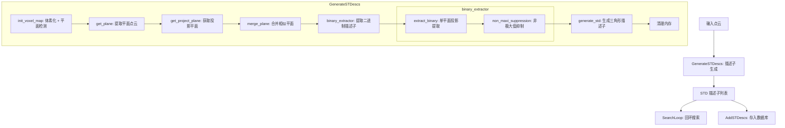

+++
title = 'BTC (Binary Triangle Context) 算法详解'
description = "本文详细介绍了用于 3D 点云位置识别的 BTC 算法，包括其核心数据结构、整体运行流程以及关键设计思想。"
date = '2026-06-29'
draft = false
tags = ["slam", "学习笔记"]
categories = ["SLAM"]
toc = true
math = false
+++

## 介绍

BTC 是一种用于 **3D 点云位置识别（Place Recognition）** 的算法，核心思想是：

1. 将点云体素化，检测平面
2. 将点云投影到平面上，提取 **二进制描述子（BinaryDescriptor）**
3. 用二进制描述子构建 **稳定三角形描述子（STD, Stable Triangle Descriptor）**
4. 通过三角形匹配实现 **回环检测**

整个流程由 `STDescManager` 类管理，分为两个核心阶段：
- **描述子生成**（[`GenerateSTDescs`](#stdescmanagergeneratestddescs--描述子生成主函数)）：从点云提取 STD 描述子
- **回环搜索**（[`SearchLoop`](#stdescmanagersearchloop--回环搜索)）：在历史数据库中搜索匹配帧

---

## 数据结构

### ConfigSetting — 配置参数

| 参数组 | 关键参数 | 说明 |
|--------|----------|------|
| 体素化 | `voxel_size_`, `voxel_init_num_` | 体素大小、最小点数阈值 |
| 平面检测 | `plane_detection_thre_` | 最小特征值阈值，低于此值判定为平面 |
| 平面合并 | `plane_merge_normal_thre_`, `plane_merge_dis_thre_` | 法向量/距离阈值 |
| 投影参数 | `proj_plane_num_`, `proj_image_resolution_`, `proj_dis_min/max_` | 投影平面数、分辨率、距离范围 |
| 二进制描述子 | `summary_min_thre_`, `line_filter_enable_` | 最小占用数、线过滤开关 |
| STD 生成 | `descriptor_near_num_`, `descriptor_min/max_len_`, `std_side_resolution_` | 近邻数、边长范围、量化分辨率 |
| 回环检测 | `skip_near_num_`, `candidate_num_`, `similarity_threshold_`, `icp_threshold_` | 跳帧数、候选数、相似度/ICP 阈值 |

### BinaryDescriptor — 二进制描述子

```cpp
occupy_array_: vector<bool>   // 占用数组，表示各高度层是否有点
summary_:      unsigned char  // 占用层数（occupy_array_ 中 true 的个数）
location_:     Vector3d       // 描述子在3D空间中的位置
```

**本质**：将一个空间区域按高度分层，用二进制位串描述该区域的几何结构。

### STD — 稳定三角形描述子

```cpp
triangle_:   Vector3d         // 三角形三边长（量化后）
angle_:      Vector3d         // 三个顶点处的角度信息
center_:     Vector3d         // 三角形中心
frame_number_: int            // 所属帧号
binary_A_:   BinaryDescriptor // 顶点A的二进制描述子
binary_B_:   BinaryDescriptor // 顶点B的二进制描述子
binary_C_:   BinaryDescriptor // 顶点C的二进制描述子
```

**本质**：三个二进制描述子构成的三角形，以三边长作为几何特征。

### BTCPlane — 平面结构

```cpp
center_:     Vector3d       // 平面中心
normal_:     Vector3d       // 法向量
covariance_: Matrix3d       // 协方差矩阵
d_:          float          // 平面方程参数 (ax+by+cz+d=0)
radius_:     float          // 平面覆盖半径
is_plane_:   bool           // 是否为有效平面
points_size_: int           // 包含点数
id_:         int            // 合并标识ID
sub_plane_num_: int         // 合并的子平面数
```

### BTCOctoTree — 体素八叉树

```cpp
voxel_points_: vector<Vector3d>  // 体素内的点
plane_ptr_:    BTCPlane*         // 拟合的平面
octo_state_:   int               // 0=叶子节点, 1=非叶子
```

### STDMatchList — 匹配列表

```cpp
match_list_:  vector<pair<STD, STD>>  // 匹配的STD对
match_id_:    pair<int, int>          // (当前帧ID, 候选帧ID)
match_frame_: int                     // 候选帧号
```

### 哈希结构

- `BTCVOXEL_LOC`：体素坐标 `(x, y, z)`，用于空间哈希
- `STD_LOC`：STD 量化坐标，用于描述子数据库索引

---

## 整体运行流程

### 主流程（以单帧处理为例）



### 回环搜索流程

当前帧 STDs → [`candidate_selector()`](#stdescmanagercandidate_selector--候选帧选择)（粗匹配：投票选出候选帧）→ 对每个候选帧执行 [`candidate_verify()`](#stdescmanagercandidate_verify--候选帧验证)（精验证）：
- 调用 [`triangle_solver()`](#stdescmanagertriangle_solver--三角形变换解算) 解算三角形变换
- 投票验证：用变换验证所有匹配对
- 调用 [`plane_geometric_verify()`](#stdescmanagerplane_geometric_verify--平面几何验证) 平面几何验证 (ICP score)

→ 输出：(最佳候选帧 ID, 得分, 变换矩阵)

---

## 各函数详解

### read_parameters() — 参数读取

```cpp
void read_parameters(ros::NodeHandle &nh, ConfigSetting &config_setting, int isHighFly)
```

**功能**：根据飞行高度（`isHighFly`）设置算法参数。

- `isHighFly = 0`（低空）：体素小（1m）、平面阈值严格、投影距离近
- `isHighFly = 1`（高空）：体素大（2m）、平面阈值宽松、投影距离远

**两组参数的关键差异**：

| 参数 | 低空 | 高空 | 影响 |
|------|------|------|------|
| `voxel_size_` | 1 | 2 | 体素越大，平面越少但更稳定 |
| `plane_detection_thre_` | 0.01 | 0.05 | 阈值越大，更容易被判定为平面 |
| `proj_plane_num_` | 2 | 1 | 使用的投影平面数 |
| `descriptor_near_num_` | 15 | 15 | KNN 近邻数 |
| `candidate_num_` | 20 | 100 | 候选帧数量上限 |

---

### binary_similarity() — 二进制相似度计算

```cpp
double binary_similarity(const BinaryDescriptor &b1, const BinaryDescriptor &b2)
```

**功能**：计算两个二进制描述子的相似度。

**算法**：改进的 Jaccard 相似度
```cpp
similarity = 2 * |b1 ∩ b2| / (|b1| + |b2|)
```
- 遍历 `occupy_array_`，统计两个描述子在同一位置都为 `true` 的个数
- 分母为两个描述子各自 `summary_` 的和
- 结果范围 `[0, 1]`，1 表示完全相同

---

### binary_greater_sort() / plane_greater_sort() — 排序比较器

```cpp
bool binary_greater_sort(BinaryDescriptor a, BinaryDescriptor b)
bool plane_greater_sort(BTCPlane *plane1, BTCPlane *plane2)
```

**功能**：用于 `std::sort` 的降序排列比较器。
- `binary_greater_sort`：按 `summary_`（占用层数）降序
- `plane_greater_sort`：按 `points_size_`（点数）降序

---

### BTCOctoTree::init_octo_tree() — 体素初始化入口

```cpp
void BTCOctoTree::init_octo_tree()
```

**功能**：判断体素内点数是否足够，足够则进行平面拟合。

**逻辑**：

若 `voxel_points_.size() > voxel_init_num_`（默认 10 个点），则调用 [`init_plane()`](#btcoctotreeinit_plane--平面拟合) 进行平面拟合。

---

### BTCOctoTree::init_plane() — 平面拟合

```cpp
void BTCOctoTree::init_plane()
```

**功能**：对体素内的点进行 PCA 平面拟合。

**算法步骤**：

1. **计算协方差矩阵**：
   ```cpp
   Σ = (1/N) * Σ(pi * pi^T) - μ * μ^T
   ```
   其中 `μ` 为点的均值（中心）

2. **特征值分解**：
   ```cpp
   Σ = V * diag(λ₁, λ₂, λ₃) * V^T
   ```
   求出三个特征值 `λ_min < λ_mid < λ_max` 及对应特征向量

3. **平面判定**：
   - 若 `λ_min < plane_detection_thre_`（默认 0.01），判定为平面
   - 法向量 = 最小特征值对应的特征向量
   - 平面半径 = `√λ_max`

4. **计算平面方程**：
   ```cpp
   d = -(n · center)
   平面: n·p + d = 0
   ```

---

### STDescManager::GenerateSTDescs() — 描述子生成主函数

```cpp
void STDescManager::GenerateSTDescs(
    pcl::PointCloud<pcl::PointXYZI>::Ptr &input_cloud,
    std::vector<STD> &stds_vec, int id)
```

**功能**：从输入点云生成 STD 描述子集合。这是描述子生成阶段的顶层函数。

**执行流程**：

- **Step 1**: [`init_voxel_map()`](#stdescmanagerinit_voxel_map--体素化)(input_cloud, voxel_map) → 体素化 + 平面检测
- **Step 2**: [`get_plane()`](#stdescmanagerget_plane--提取平面点云)(voxel_map, plane_cloud) → 提取所有平面中心 + 法向量，保存到 `plane_cloud_vec_`
- **Step 3**: [`get_project_plane()`](#stdescmanagerget_project_plane--获取投影平面)(voxel_map, proj_plane_list) → 获取可用于投影的平面列表；若无平面，创建一个默认水平面；[`merge_plane()`](#stdescmanagermerge_plane--平面合并) 合并相似平面
- **Step 4**: [`binary_extractor()`](#stdescmanagerbinary_extractor--二进制描述子提取)(merge_plane_list, input_cloud, binary_list) → 提取二进制描述子
- **Step 5**: [`generate_std()`](#stdescmanagergenerate_std--三角形描述子生成)(binary_list, frame_id, stds_vec) → 生成三角形描述子
- **Step 6**: 清理 voxel_map 内存

---

### STDescManager::init_voxel_map() — 体素化

```cpp
void STDescManager::init_voxel_map(
    const pcl::PointCloud<pcl::PointXYZI>::Ptr &input_cloud,
    std::unordered_map<BTCVOXEL_LOC, BTCOctoTree *> &voxel_map)
```

**功能**：将点云分配到哈希体素中，并对每个体素进行平面拟合。

**算法**：

1. **遍历所有点**，计算所属体素坐标：
   ```cpp
   loc = floor(point / voxel_size)
   ```
   使用 `BTCVOXEL_LOC` 作为哈希键

2. **分配点到体素**：若体素不存在则创建 `BTCOctoTree`

3. **并行初始化**：对每个体素调用 [`init_octo_tree()`](#btcoctotreeinit_octo_tree--体素初始化入口) 进行平面拟合

---

### STDescManager::get_plane() — 提取平面点云

```cpp
void STDescManager::get_plane(
    const std::unordered_map<BTCVOXEL_LOC, BTCOctoTree *> &voxel_map,
    pcl::PointCloud<pcl::PointXYZINormal>::Ptr &plane_cloud)
```

**功能**：从体素地图中提取所有被判定为平面的体素，输出为点云。

**输出**：每个平面体素输出一个点，包含：
- 坐标 = 平面中心
- 法向量 = 平面法向量

这些平面点云会被保存到 `plane_cloud_vec_`，后续用于几何验证。

---

### STDescManager::get_project_plane() — 获取投影平面

```cpp
void STDescManager::get_project_plane(
    std::unordered_map<BTCVOXEL_LOC, BTCOctoTree *> &voxel_map,
    std::vector<BTCPlane *> &project_plane_list)
```

**功能**：从体素地图中提取所有平面，并通过聚类合并相似平面。

**算法步骤**：

1. **收集所有平面**：遍历体素地图，收集 `is_plane_ = true` 的平面

2. **平面聚类**（Union-Find 思想）：
   - 遍历所有平面对 `(i, j)`
   - 若法向量相似（`|n_i - n_j| < threshold` 或 `|n_i + n_j| < threshold`）
   - 且距离相近（点到平面距离 `< threshold`）
   - 则分配相同的 `id_`

3. **合并同组平面**：
   - 合并协方差矩阵：`Σ_merged = (P_PT1 + P_PT2) / N - μ * μ^T`
   - 合并中心：加权平均
   - 重新计算法向量和半径

---

### STDescManager::merge_plane() — 平面合并

```cpp
void STDescManager::merge_plane(std::vector<BTCPlane *> &origin_list,
                                std::vector<BTCPlane *> &merge_plane_list)
```

**功能**：与 [`get_project_plane()`](#stdescmanagerget_project_plane--获取投影平面) 类似的平面合并逻辑，但输入是已排序的平面列表。

**与 `get_project_plane` 的区别**：
- 输入已按点数降序排列
- 合并后的平面会递归计算新的特征值和法向量
- 未合并的平面（`id_ = 0`）也保留

**合并公式**：
```cpp
新中心 = (n₁ * μ₁ + n₂ * μ₂) / (n₁ + n₂)
新协方差 = (ΣP_PT₁ + ΣP_PT₂) / (n₁ + n₂) - 新中心 * 新中心^T
```

---

### STDescManager::binary_extractor() — 二进制描述子提取

```cpp
void STDescManager::binary_extractor(
    const std::vector<BTCPlane *> proj_plane_list,
    const pcl::PointCloud<pcl::PointXYZI>::Ptr &input_cloud,
    std::vector<BinaryDescriptor> &binary_descriptor_list)
```

**功能**：对多个投影平面分别提取二进制描述子，并进行后处理。

**流程**：

1. **遍历投影平面**（最多 `proj_plane_num_` 个）：
   - 跳过法向量过于相似的连续平面
   - 对每个平面调用 [`extract_binary()`](#stdescmanagerextract_binary--单平面二进制描述子提取)

2. **非极大值抑制**：[`non_maxi_suppression()`](#stdescmanagernon_maxi_suppression--非极大值抑制)

3. **数量控制**：保留最多 `useful_corner_num_` 个描述子（按 `summary_` 排序）

---

### STDescManager::extract_binary() — 单平面二进制描述子提取

```cpp
void STDescManager::extract_binary(
    const Eigen::Vector3d &project_center,
    const Eigen::Vector3d &project_normal,
    const pcl::PointCloud<pcl::PointXYZI>::Ptr &input_cloud,
    std::vector<BinaryDescriptor> &binary_list)
```

**功能**：将点云投影到指定平面，生成二进制描述子图像。

**这是整个算法最核心的函数，详细步骤如下**：

#### Step 1: 构建投影坐标系
```cpp
平面法向量: n = (A, B, C)
平面中心: c = project_center

x_axis: 与法向量正交的单位向量
y_axis: n × x_axis（叉积）

投影坐标: (px, py) = (点投影到y_axis的分量, 点投影到x_axis的分量)
```

#### Step 2: 点云投影
对每个点：
1. 计算到平面的距离 `d = |Ax + By + Cz + D|`
2. 若 `d ∉ [dis_min, dis_max]`，跳过
3. 将点投影到平面：`proj_point = point - d * n`
4. 计算 2D 坐标 `(px, py)`

#### Step 3: 构建距离图像
```cpp
分辨率: resolution = 0.5m
图像尺寸: x_axis_len * y_axis_len

对每个像素 (x, y):
  统计落入该像素的点数 img_count[x][y]
  记录每个点到平面的距离列表 dis_container[x][y]
```

#### Step 4: 生成二进制编码
```cpp
高度分层数: cut_num = (dis_max - dis_min) / high_inc

对每个像素:
  将距离列表分层统计 cnt_list[layer]
  若 cnt_list[layer] >= 1, occupy[layer] = true
  summary = 占用层数
```

**二进制编码示意**：
```cpp
高度层:    [层0] [层1] [层2] [层3] [层4] ...
占用情况:   1     0     1     1     0    ...
occupy_array_ = [true, false, true, true, false, ...]
summary_ = 3
```

#### Step 5: 分段筛选
将图像分成 `segmen_base_num * segmen_base_num` 的段：
- 每段内找 `summary` 最大的像素
- 必须 `summary >= summary_min_thre_`（默认 10）

#### Step 6: 线过滤（可选）
检查候选点是否位于"线"上：
- 在 4 个方向（水平、垂直、两个对角）检查
- 若两侧都有高响应值，说明是线结构，过滤掉

#### Step 7: 恢复 3D 坐标
```cpp
3D位置 = py * x_axis + px * y_axis + project_center
```

---

### STDescManager::non_maxi_suppression() — 非极大值抑制

```cpp
void STDescManager::non_maxi_suppression(std::vector<BinaryDescriptor> &binary_list)
```

**功能**：在局部邻域内保留 `summary` 最大的描述子，避免聚集。

**算法**：
1. 构建 KD-Tree
2. 对每个描述子，搜索半径 `non_max_suppression_radius_` 内的邻居
3. 若存在邻居的 `summary` 更大，则标记当前描述子为待移除
4. 保留未被标记的描述子

---

### STDescManager::generate_std() — 三角形描述子生成

```cpp
void STDescManager::generate_std(
    const std::vector<BinaryDescriptor> &binary_list, const int &frame_id,
    std::vector<STD> &std_list)
```

**功能**：从二进制描述子集合中构建三角形描述子。

**算法**：

1. **构建 KD-Tree**：对所有描述子位置建立 KD-Tree

2. **KNN 搜索**：对每个描述子搜索 K 个最近邻（默认 `K=15`）

3. **三角形构建**：对每三个点 `(p1, p2, p3)` 构建三角形：
   ```cpp
   a = |p1 - p2|, b = |p1 - p3|, c = |p2 - p3|
   ```

4. **边长约束**：
   - 每条边必须在 `[min_len, max_len]` 范围内（默认 `[2, 50]`）
   - 不能退化（`|c - (a+b)| < 0.2` 表示近似共线）

5. **排序去重**：
   - 对三边排序：`a ≤ b ≤ c`
   - 用 `(a * 1000, b * 1000, c * 1000)` 作为哈希键去重
   - 保证相同的三角形只生成一次

6. **构建 STD**：
   ```cpp
   triangle_ = (a, b, c) * scale    // 量化后的边长
   center_ = (A + B + C) / 3         // 三角形中心
   binary_A_, binary_B_, binary_C_   // 三个顶点的二进制描述子
   ```

---

### STDescManager::AddSTDescs() — 添加描述子到数据库

```cpp
void STDescManager::AddSTDescs(const std::vector<STD> &stds_vec)
```

**功能**：将当前帧的 STD 描述子存入全局哈希数据库。

**算法**：
1. 递增帧计数器 `current_frame_id_`
2. 对每个 STD，计算量化位置 `(int)(triangle_[i] + 0.5)`
3. 存入 `data_base_` 哈希表，键为 `STD_LOC`

---

### STDescManager::SearchLoop() — 回环搜索

```cpp
void STDescManager::SearchLoop(
    std::vector<STD> &stds_vec, std::pair<int, double> &loop_result,
    std::pair<Eigen::Vector3d, Eigen::Matrix3d> &loop_transform,
    std::vector<std::pair<STD, STD>> &loop_std_pair, ...)
```

**功能**：在历史数据库中搜索与当前帧匹配的回环帧。

**流程**：

- **Step 1**: [`candidate_selector()`](#stdescmanagercandidate_selector--候选帧选择)(stds_vec, candidate_matcher_vec) → 粗匹配，投票选出 top-N 候选帧
- **Step 2**: 对每个候选帧执行 [`candidate_verify()`](#stdescmanagercandidate_verify--候选帧验证) → 精验证：解算变换 + 投票 + 平面几何验证
- **Step 3**: 选择得分最高的候选 → 若 `best_score > icp_threshold_`，确认回环

**输出**：
- `loop_result = (candidate_id, score)`：-1 表示无回环
- `loop_transform = (t, R)`：相对变换
- `loop_std_pair`：匹配的 STD 对

---

### STDescManager::candidate_selector() — 候选帧选择

```cpp
void STDescManager::candidate_selector(
    std::vector<STD> &current_STD_list,
    std::vector<STDMatchList> &candidate_matcher_vec)
```

**功能**：通过粗匹配和投票快速筛选候选回环帧。

**算法**：

1. **遍历当前帧的每个 STD**：
   - 在数据库中搜索量化坐标附近的 27 个邻域体素（3×3×3）
   - 对每个匹配的 STD：
     - 检查帧号差 `> skip_near_num_`（避免近邻帧）
     - 计算三角形边长距离 `< rough_dis_threshold_ * ||triangle||`
     - 计算三个二进制描述子的平均相似度 `> similarity_threshold_`
   - 若满足条件，记录匹配

2. **投票统计**：
   - 对每个历史帧统计匹配数 `match_array[frame_id] += 1`
   - 按匹配数降序排列

3. **构建候选列表**：
   - 选择 top-`candidate_num_` 个候选帧
   - 每个候选帧需至少 5 个匹配

---

### STDescManager::candidate_verify() — 候选帧验证

```cpp
void STDescManager::candidate_verify(
    STDMatchList &candidate_matcher, double &verify_score,
    std::pair<Eigen::Vector3d, Eigen::Matrix3d> &relative_pose,
    std::vector<std::pair<STD, STD>> &sucess_match_list, ...)
```

**功能**：对候选帧进行几何验证，确认回环。

**算法**：

1. **采样**：从匹配列表中均匀采样（最多 50 个）

2. **RANSAC 式验证**：
   - 对每个采样匹配对，调用 [`triangle_solver()`](#stdescmanagertriangle_solver--三角形变换解算) 解算变换 `(R, t)`
   - 用该变换验证所有匹配对：
     - 将当前帧的 A/B/C 点变换到候选帧坐标系
     - 若三个点都与候选帧对应点距离 `< dis_threshold`（默认 3m），计一票
   - 保留得票最高的变换

3. **阈值判断**：`max_vote >= 4` 才继续

4. **几何验证**：调用 [`plane_geometric_verify()`](#stdescmanagerplane_geometric_verify--平面几何验证) 计算最终得分

---

### STDescManager::triangle_solver() — 三角形变换解算

```cpp
void STDescManager::triangle_solver(std::pair<STD, STD> &std_pair,
                                    Eigen::Vector3d &t, Eigen::Matrix3d &rot)
```

**功能**：从一对匹配的 STD 解算刚体变换 `(R, t)`。

**算法**（SVD 分解法）：

1. **构建对应点矩阵**：
   ```cpp
   src = [A-c, B-c, C-c]  （当前帧，去中心化）
   ref = [A'-c', B'-c', C'-c']  （候选帧，去中心化）
   ```

2. **计算协方差矩阵**：
   ```cpp
   H = src * ref^T
   ```

3. **SVD 分解**：
   ```cpp
   H = U * Σ * V^T
   R = V * U^T
   ```

4. **处理反射情况**：
   - 若 `det(R) < 0`，修正为 `R = V * K * U^T`（K 为修正矩阵）

5. **计算平移**：
   ```cpp
   t = -R * c_src + c_ref
   ```

---

### STDescManager::plane_geometric_verify() — 平面几何验证

```cpp
double STDescManager::plane_geometric_verify(
    const pcl::PointCloud<pcl::PointXYZINormal>::Ptr &source_cloud,
    const pcl::PointCloud<pcl::PointXYZINormal>::Ptr &target_cloud,
    const std::pair<Eigen::Vector3d, Eigen::Matrix3d> &transform)
```

**功能**：用平面点云进行几何验证，计算匹配得分。

**算法**：

1. **构建 KD-Tree**：对目标平面点云建树

2. **逐点验证**：
   - 将源平面点变换到目标坐标系：`p' = R * p + t`
   - 同时变换法向量：`n' = R * n`
   - 搜索最近邻
   - 检查：
     - 法向量一致：`|n' - n_target| < normal_threshold` 或 `|n' + n_target| < normal_threshold`
     - 点到平面距离：`|n_target^T * (p' - p_target)| < dis_threshold`

3. **计算得分**：
   ```cpp
   score = 匹配点数 / 源点云总点数
   ```
   得分范围 `[0, 1]`，越高越好

---

## 关键设计思想

### 为什么用二进制描述子？
- **高效**：占用数组可用位运算快速比较
- **鲁棒**：对点云密度变化不敏感（只关心"有无点"而非"多少点"）
- **紧凑**：每个描述子仅需一个 `vector<bool>` + 一个字节

### 为什么用三角形？
- **旋转/平移不变**：三角形边长在刚体变换下不变
- **尺度稳定**：通过边长范围约束，避免退化三角形
- **高效匹配**：三边长可量化为整数，用哈希表快速查找

### 为什么用平面投影？
- **降维**：3D → 2D，简化描述子提取
- **结构化**：平面是最常见的建筑/地面结构
- **多视角**：多个投影平面可捕获不同方向的几何特征

---

## 参考

无
