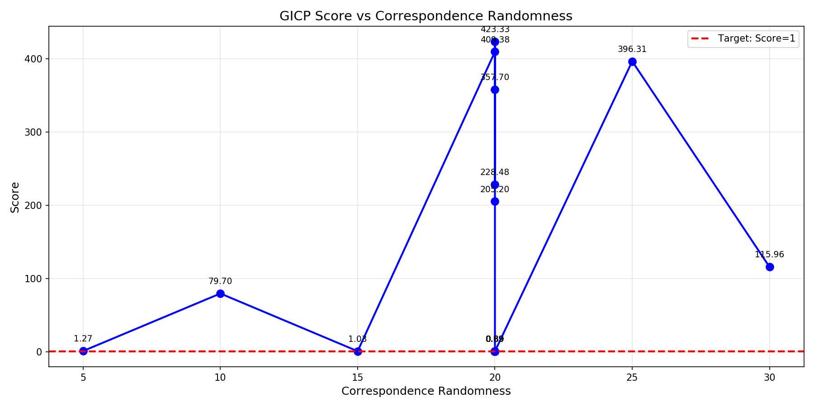
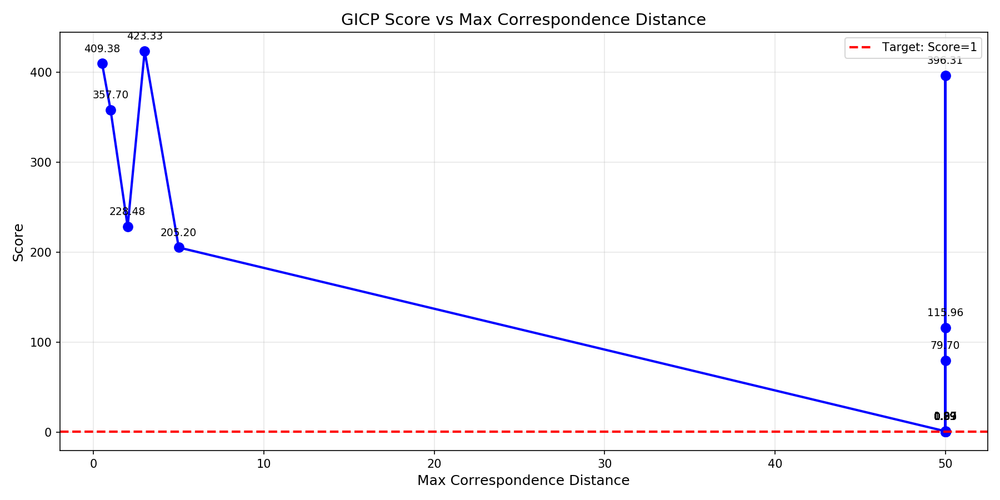
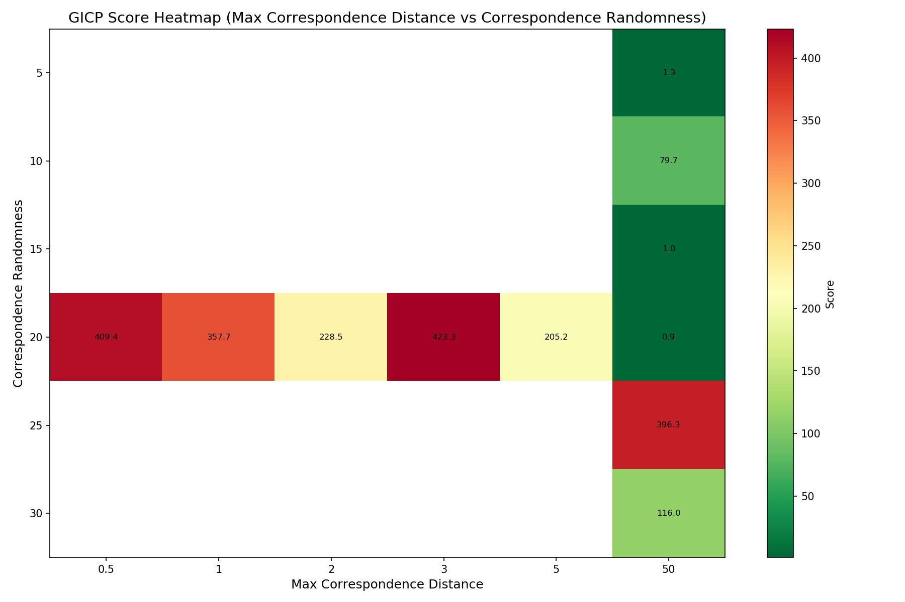
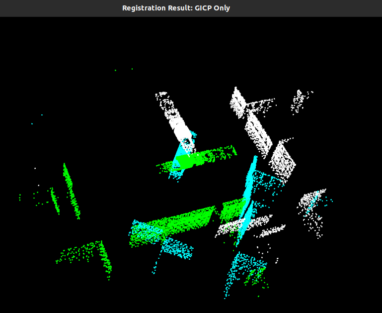
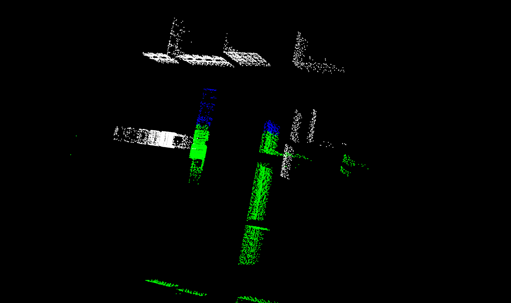

+++
title = '点云配准'
description = "关于常用的点云配准方法对比使用"
date = '2026-04-01'
draft = true
tags = ["学习笔记", "C++", "SLAM"， "雷达"]
categories = ["SLAM"]
# weight = 1
# slug = ""
# aliases = []
# series = []
# externalLink = ""
# toc = true
# math = false
+++

## 点云配准方法介绍

常见的有 ICP、GICP、NDT 等，快捷实现基本基于 PCL 库中自带的点云处理实现。

### GICP

#### 原理

 Generalized Iterative Closest Point (GICP) 是一种改进的 ICP 算法，通过协方差矩阵优化对应点匹配，提升配准精度。

#### 头文件

```cpp
#include <pcl/point_types.h>          // 点类型定义
#include <pcl/point_cloud.h>          // 点云容器
#include <pcl/registration/gicp.h>    // GICP 算法核心
#include <pcl/registration/icp.h>     // ICP 基类（部分功能依赖）
#include <pcl/features/normal_3d.h>    // 法向量估计（GICP 需要）
#include <pcl/filters/voxel_grid.h>   // 下采样（可选）
#include <pcl/io/pcd_io.h>            // PCD 文件读写
```

#### 参数配置

| 参数 | 值 | 说明 |
|------|-----|------|
| setMaximumIterations | 200 | 最大迭代次数，达到后停止配准 |
| setTransformationEpsilon | 1e-10 | 变换矩阵变化的收敛阈值 |
| setEuclideanFitnessEpsilon | 0.0001 | 点到点欧氏距离误差的收敛阈值 |
| setMaxCorrespondenceDistance | 1.0 | 对应点搜索半径上限 |
| setCorrespondenceRandomness | 50 | 每次迭代随机采样对应点数量 |
| setRANSACOutlierRejectionThreshold | 0.05 | RANSAC 离群点阈值 |

---

## 参数测试分析

### GICP

#### 测试概述

| 指标 | 值 |
|------|-----|
| Baseline Score | 82.0 |
| Best Score | 0.8919 |
| Worst Score | 423.34 |
| Average Score | 54.78 |
| Score < 1 占比 | 75.6% |

#### 敏感性分析

| 参数 | 敏感性 | 最优值 | 建议范围 |
|------|--------|--------|----------|
| correspondence_randomness | **高** | 20 | 15-20 |
| max_correspondence_distance | **高** | 50.0 | 默认值 50.0 |
| ransac_outlier_rejection_threshold | 无 | 0.05 | 默认值 |
| ransac_iterations | 无 | 1000 | 默认值 |
| euclidean_fitness_epsilon | 无 | 0.0001 | 默认值 |
| transformation_epsilon | 无 | 1e-10 | 默认值 |
| transformation_rotation_epsilon | 无 | 1e-10 | 默认值 |
| max_iterations | 无 | 500 | 默认值 |
| use_reciprocal_correspondences | 无 | false | 默认值 |

#### 最优配置

```yaml
gicp:
  correspondence_randomness: 20          # 核心调优参数
  max_correspondence_distance: 50.0      # 核心调优参数
  max_iterations: 500
  transformation_epsilon: 1e-10
  euclidean_fitness_epsilon: 0.0001
  ransac_iterations: 1000
  ransac_outlier_rejection_threshold: 0.05
  transformation_rotation_epsilon: 1e-10
  use_reciprocal_correspondences: false
```

#### correspondence_randomness 影响

| 值 | Score | 影响 |
|----|-------|------|
| 5 | 1.27 | 较差 |
| 10 | 79.70 | 很差 |
| 15 | 1.03 | 接近最优 |
| **20** | **0.89** | **最优** |
| 25 | 396.31 | 极差 |
| 30 | 115.96 | 很差 |

呈尖锐 U 型曲线，最优点在 20 附近。

#### max_correspondence_distance 影响

| cr 固定值 | mcd | Score |
|-----------|-----|-------|
| 20 | 0.5 | 409.38 |
| 20 | 1.0 | 357.70 |
| 20 | 2.0 | 228.48 |
| 20 | 3.0 | 423.34 |
| 20 | 5.0 | 205.20 |
| **20** | **50.0** | **0.89** |

默认值 50.0 是最优选择。

#### 参数扫描曲线





#### 双参数热力图



#### 结论

- `correspondence_randomness=20` + `max_correspondence_distance=50.0` 是最优配置
- Score 从 82 降至 **0.89**
- 其他 7 个参数保持默认值即可，无需进一步调优

---

## 测试结果

### GICP Only

#### 参数配置

```cpp
gicp.setMaximumIterations(500);
gicp.setTransformationEpsilon(1e-10);
gicp.setEuclideanFitnessEpsilon(0.0001);
gicp.setMaxCorrespondenceDistance(50.0);
gicp.setCorrespondenceRandomness(100);
gicp.setRANSACOutlierRejectionThreshold(0.05);
```

#### 输出结果

```terminal
Method: GICP Only
Target: 21689 points, 140.144 x 192.66 x 23.4657 m
Source: 21689 points, 192.66 x 140.144 x 23.4657 m

--- Actual Transform (target -> src) ---
-4.37114e-08           -1            0           10
           1 -4.37114e-08            0           10
           0            0            1           10
           0            0            0            1
T: [10, 10, 10]
R: [90, -0, 0] deg
[GICP Only] Score: 82.0019, Time: 1433.34 ms

--- Estimated Transform (target -> src) ---
  0.769358  -0.635887 -0.0611232    7.76722
  0.608848   0.758862  -0.231156    10.0674
  0.193373   0.140627   0.970995    11.3946
        -0          0         -0          1
T: [7.76722, 10.0674, 11.3946]
R: [38.3571, -11.1497, 8.24071] deg
Trans error: 2.63339 m, Rot error: 42.3897 deg
```

#### 效果展示



---

### NDT + GICP

#### 参数配置

```cpp
// GICP 精细配准
gicp_fine.setMaximumIterations(200);
gicp_fine.setTransformationEpsilon(1e-10);
gicp_fine.setEuclideanFitnessEpsilon(0.0001);
gicp_fine.setMaxCorrespondenceDistance(1.0);
gicp_fine.setCorrespondenceRandomness(50);
gicp_fine.setRANSACOutlierRejectionThreshold(0.05);

// NDT 粗配准
ndt.setTransformationEpsilon(0.005);
ndt.setStepSize(1);
ndt.setResolution(150);
ndt.setMaximumIterations(300);
```

#### 输出结果

```terminal
Method: NDT+GICP
Target: 21689 points, 140.144 x 192.66 x 23.4657 m
Source: 21689 points, 192.66 x 140.144 x 23.4657 m

--- Actual Transform (target -> src) ---
-4.37114e-08           -1            0           10
           1 -4.37114e-08            0           10
           0            0            1           10
           0            0            0            1
T: [10, 10, 10]
R: [90, -0, 0] deg
[NDT] Has converged: 1, score: 2.89081
[NDT+GICP] Score: 3.22261e-07, Time: 5148.47 ms

--- Estimated Transform (target -> src) ---
 -3.8302e-08           -1  1.11758e-07      10.0001
           1 -3.86486e-08   1.2368e-05      9.99976
 -1.2368e-05  1.04309e-07            1      10.0002
          -0           -0           -0            1
T: [10.0001, 9.99976, 10.0002]
R: [90, 0.000708632, 6.40331e-06] deg
Trans error: 0.000328527 m, Rot error: 0 deg
```

#### 效果展示



---

### ICP

待补充。
