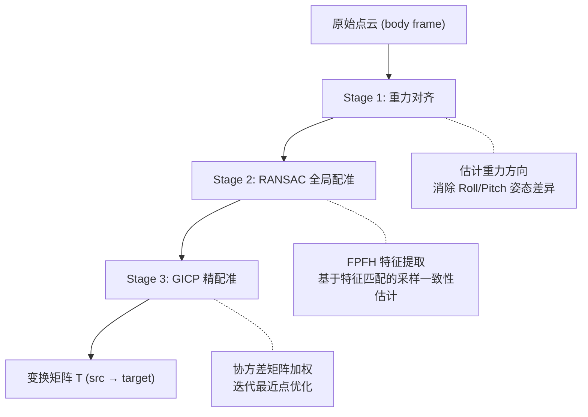
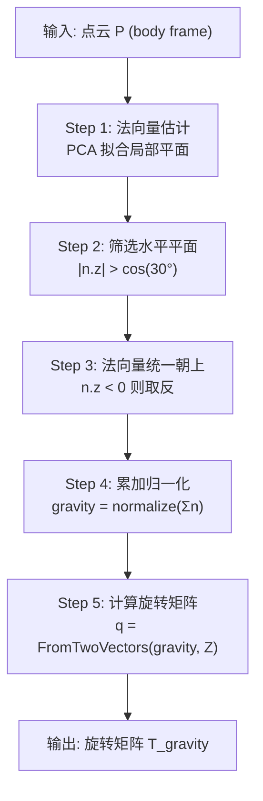
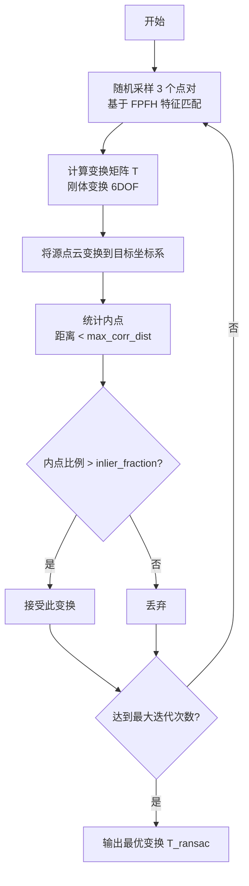
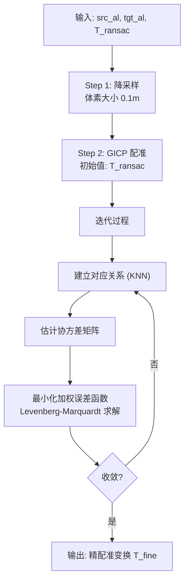
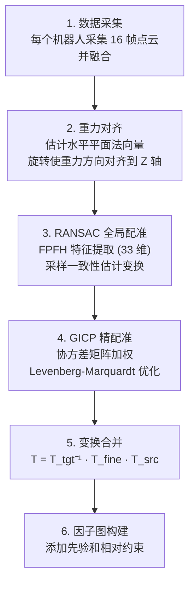

+++
title = "多机器人初始配准方法"
description = "多机器人系统中基于重力对齐、RANSAC 全局配准和 GICP 精配准的三阶段初始配准策略"
date = 2026-05-31
draft = false
tags = ["slam", "雷达", "优化", "学习笔记"]
categories = ["SLAM"]
math = true
+++

## 介绍

多机器人系统初始化时，各机器人的局部坐标系往往不一致，需要通过点云配准将它们统一到同一个世界坐标系。本文介绍一种**三阶段配准策略**：重力对齐消除姿态差异、RANSAC 全局粗配准找到大致变换、GICP 精配准优化精度。三个阶段层层递进，兼顾鲁棒性和精度。

## 三阶段配准策略

整个配准流程分为三个阶段，每个阶段解决不同层次的问题：



| 阶段 | 目标 | 方法 | 输出 |
|------|------|------|------|
| Stage 1 | 消除 Roll/Pitch 姿态差异 | 水平平面法向量统计 | 旋转矩阵 $T_{gravity}$ |
| Stage 2 | 全局粗配准 | FPFH + RANSAC | 粗配准变换 $T_{ransac}$ |
| Stage 3 | 高精度精配准 | GICP 协方差加权 | 精配准变换 $T_{fine}$ |

## 数据准备

### 点云融合

每个机器人采集 `init_frame_num`（默认 16）帧点云并融合，提高配准鲁棒性。单帧点云的特征信息有限，多帧融合后点云密度更高，几何特征更丰富，配准成功率显著提升。

| 机器人 | 融合方式 | 说明 |
|--------|---------|------|
| Robot 0（目标） | $target = \sum_{i=0}^{15} measure[0][i].lidar$ | 作为参考坐标系 |
| Robot 1（源） | $src = \sum_{i=0}^{15} measure[1][i].lidar$ | 与 Robot 0 配准 |
| Robot N（源） | $src = \sum_{i=0}^{15} measure[N][i].lidar$ | 与 Robot 0 配准 |

- **Robot 0** 作为参考坐标系（世界坐标系）
- **Robot 1 ~ N** 分别与 Robot 0 进行配准
- 配准结果存储在 `drone_gicp_poses_[robot_id]`

## Stage 1：重力对齐

### 目的

不同机器人的安装姿态可能不同，导致 Roll/Pitch 存在差异。重力对齐通过估计重力方向，将点云旋转到统一的重力对齐坐标系，消除姿态差异。

### 实现步骤



| 步骤 | 操作 | 参数 |
|------|------|------|
| 法向量估计 | 对每个点使用半径邻近点进行 PCA 拟合 | 半径 $r = 0.5m$ |
| 筛选水平平面 | 法向量与 Z 轴夹角 < 30° 的平面 | $\|n.z\| > 0.866$ |
| 法向量统一 | 如果 $n.z < 0$，则 $n = -n$ | - |
| 累加归一化 | $gravity_{est} = normalize(\sum n_i)$ | - |
| 旋转矩阵 | $q = FromTwoVectors(gravity_{est}, [0,0,1])$ | - |

### 原理说明

场景中的水平平面（地面、天花板、桌面）的法向量接近重力方向。通过统计这些法向量，可以估计重力方向并进行对齐。

```
重力对齐前:                    重力对齐后:

    ╱╲                              │
   ╱  ╲  Roll=10°                   │  Roll=0°
  ╱    ╲                            │
 ╱______╲                       ────┼────
```

### 局限性

- 需要场景中有足够的水平平面
- 如果点云已经重力对齐（来自 LiDAR-IMU 里程计），此步骤可能多余
- 法向量估计对点云密度和噪声敏感

## Stage 2：RANSAC 全局配准

### 目的

在重力对齐的基础上，进行全局粗配准，找到大致的平移和 Yaw 旋转。RANSAC 通过随机采样和一致性检验，能够在存在大量误匹配的情况下找到正确变换。

### FPFH 特征提取

FPFH（Fast Point Feature Histograms）是一种局部几何特征描述子，用于描述点云中每个点的局部几何形状，具有旋转不变性和平移不变性。每个点的 FPFH 特征为 33 维向量。

#### 局部坐标系建立

对点 $p$ 和其邻近点 $q$，建立局部坐标系 $(u, v, w)$：

| 轴 | 定义 | 说明 |
|----|------|------|
| $u$ | $n_p$ | 点 $p$ 的法向量 |
| $v$ | $u \times (q - p) / \|q - p\|$ | 与连线垂直 |
| $w$ | $u \times v$ | 右手坐标系 |

```
              w
              ↑
              │
              │
    q ────────┼──────── p
              │
              │
              ↓
              v

    u 指向屏幕外 (n_p 方向)
```

#### 三个特征值

对点 $p$ 和其邻近点 $q$，计算三个几何特征：

**特征 1：$\alpha$ (alpha)**

$$\alpha = v \cdot n_q$$

含义为邻近点法向量 $n_q$ 在 $v$ 方向的投影，范围 $[-1, 1]$。

```
        n_q
         ↑
         │
         │   α = cos(angle between v and n_q)
         │  ╱
         │ ╱
    ─────┼───── q
         │
         ↓ v
```

**特征 2：$\varphi$ (phi)**

$$\varphi = u \cdot (q - p) / \|q - p\|$$

含义为点 $p$ 的法向量 $u$ 与连线 $(q-p)$ 的夹角余弦，范围 $[-1, 1]$。

```
        n_p = u
         ↑
         │
         │   φ = cos(angle between u and (q-p))
         │  ╱
         │ ╱
    ─────┼───── p
         │
         ↓
         q
```

**特征 3：$\theta$ (theta)**

$$\theta = atan2(w \cdot n_q, u \cdot n_q)$$

含义为邻近点法向量 $n_q$ 在 $u$-$w$ 平面的旋转角，范围 $[0, 2\pi]$。

```
        w
        ↑
        │   n_q
        │  ╱
        │ ╱ θ
        │╱
    ────┼──── u
        │
        ↓
```

#### 直方图构建

将三个特征值分别离散化为直方图，最终拼接为 33 维特征向量：

| 特征 | Bin 数 | 范围 | 维度 |
|------|--------|------|------|
| $\alpha$ | 11 | $[-1, 1]$ | 11 |
| $\varphi$ | 11 | $[-1, 1]$ | 11 |
| $\theta$ | 11 | $[0, 2\pi]$ | 11 |
| **合计** | - | - | **33** |

#### 特征的物理含义

| 特征 | 物理含义 | 平面区域 | 边缘区域 | 曲面区域 |
|------|---------|---------|---------|---------|
| $\alpha$ | 邻近点法向量在 $v$ 方向的分量 | 集中在 0 | 分散 | 分散 |
| $\varphi$ | 当前点法向量与连线的夹角 | 集中在 $\pm 1$ | 分散 | 中等 |
| $\theta$ | 邻近点法向量在 $u$-$w$ 平面的旋转角 | 集中 | 分散 | 中等 |

#### SPFH 到 FPFH 的加权累加

SPFH 只考虑直接邻近点（1 邻域），FPFH 通过加权累加考虑更远邻域（2 邻域）的影响：

$$FPFH(p) = SPFH(p) + \frac{1}{k} \sum_{i=1}^{k} \frac{1}{w_i} \cdot SPFH(q_i)$$

其中 $k$ 为点 $p$ 的邻近点数量，$w_i$ 为点 $p$ 到 $q_i$ 的距离。

```
1 邻域 (SPFH):                2 邻域 (FPFH):

      q1                            q1
       │                             │
       │                             │
       p ─── q2                  p ─── q2 ─── q3
       │                             │
       │                             │
      q4                            q4 ─── q5

只考虑 p 的直接邻近点          考虑 p 的邻近点的邻近点
```

#### 特征不变性

- **旋转不变性**：基于相对角度 $(\alpha, \varphi, \theta)$，不依赖绝对坐标系
- **平移不变性**：基于相对位置 $(q - p)$，不依赖绝对位置
- **尺度鲁棒性**：对点云密度变化有一定容忍度，直方图的分布模式保持稳定

### RANSAC 采样一致性

RANSAC 通过随机采样和内点检验，在存在大量误匹配的情况下找到正确的刚体变换。



FPFH 在 RANSAC 中的作用：传统 ICP 只用距离找对应点，容易陷入局部最优。RANSAC + FPFH 基于几何特征匹配，找到更可靠的对应关系，对初始位置不敏感，适合全局配准。

### RANSAC 参数配置

| 参数 | 值 | 说明 |
|------|-----|------|
| 体素大小 | 0.3 m | 粗配准降采样 |
| 法向量估计半径 | 0.5 m | PCA 拟合邻域 |
| FPFH 特征半径 | 0.8 m | 特征计算邻域 |
| 最大迭代次数 | 50000 | RANSAC 采样上限 |
| 每次采样点数 | 3 | 计算刚体变换所需最少点 |
| 最大对应距离 | 2.5 m | 内点判定阈值 |
| 内点比例阈值 | 0.33 | 接受变换的最低内点比例 |

## Stage 3：GICP 精配准

### 目的

在 RANSAC 粗配准的基础上，进行高精度精配准。GICP（Generalized Iterative Closest Point）在传统 ICP 基础上引入协方差矩阵加权，提高配准精度和鲁棒性。

### 误差函数

$$E(T) = \sum_i (T \cdot p_i - q_i)^T \cdot (C_{q[i]} + T \cdot C_{p[i]} \cdot T^T)^{-1} \cdot (T \cdot p_i - q_i)$$

| 符号 | 含义 |
|------|------|
| $T$ | 4×4 变换矩阵 |
| $p_i$ | 源点云中的点 |
| $q_i$ | 目标点云中的对应点 |
| $C_{p[i]}, C_{q[i]}$ | 协方差矩阵（描述局部表面几何） |

### 协方差矩阵的作用

协方差矩阵描述了局部表面的几何特性，不同几何区域的协方差差异决定了配准时的权重分配：

| 区域类型 | 法向量方向 | 协方差矩阵 | 权重 | 约束强度 |
|---------|-----------|-----------|------|---------|
| 平坦区域 | 确定 | 大 | 高 | 强 |
| 边缘/角点 | 不确定 | 小 | 低 | 弱 |

```
平坦区域:                    边缘/角点:
    ─────────                    │
    协方差矩阵大                  │ 协方差矩阵小
    权重高                        权重低
    约束强                        约束弱
```

### 实现步骤



### GICP 参数配置

| 参数 | 值 | 说明 |
|------|-----|------|
| 体素大小 | 0.1 m | 精配准降采样 |
| 最大迭代次数 | 100 | 迭代上限 |
| 最大对应距离 | 1.0 m | 对应点搜索半径 |
| 邻近点数 | 20 | 协方差估计用 KNN |

## 变换矩阵合并

### DOF 约束

根据运动学约束，限制变换的自由度：

| 模式 | 自由度 | 锁定项 |
|------|--------|--------|
| 3-DOF | X, Y 平移 + Yaw 旋转 | Z=0, Roll=0, Pitch=0 |
| 4-DOF | X, Y, Z 平移 + Yaw 旋转 | Roll=0, Pitch=0 |

### 最终变换矩阵

$$T_{total} = T_{gravity\_tgt}^{-1} \cdot T_{fine} \cdot T_{gravity\_src}$$

合并过程：

1. $T_{gravity\_src}$：将源点云旋转到重力对齐坐标系
2. $T_{fine}$：在重力对齐坐标系下进行配准
3. $T_{gravity\_tgt}^{-1}$：旋转回原始坐标系

## 多机器人并行配准

各机器人的 GICP 配准相互独立，可以并行执行以加速初始化过程：

```cpp
std::vector<std::thread> threads;
for (int drone_id = 1; drone_id < num_robots_; ++drone_id) {
    threads.emplace_back([this, drone_id, &target_cloud]() {
        drone_gicp_poses_[drone_id] = GicpRegistration(src_cloud, target_cloud);
    });
}
for (auto& t : threads) t.join();
```

配准完成后，构建 GTSAM 因子图：

- **Robot 0**：PriorFactor（先验，固定为世界坐标系原点）
- **Robot 1 ~ N**：BetweenFactor（相对约束）

## 配置参数汇总

| 类别 | 参数 | 值 | 说明 |
|------|------|-----|------|
| 体素降采样 | coarse_voxel_size | 0.3 m | 粗配准体素大小 |
| 体素降采样 | fine_voxel_size | 0.1 m | 精配准体素大小 |
| 法向量估计 | normal_radius | 0.5 m | 法向量估计半径 |
| FPFH 特征 | fpfh_radius | 0.8 m | FPFH 特征半径 |
| RANSAC | ransac_max_iterations | 50000 | 最大迭代次数 |
| RANSAC | ransac_max_corr_dist | 2.5 m | 最大对应距离 |
| RANSAC | ransac_inlier_fraction | 0.33 | 内点比例阈值 |
| GICP | gicp_max_iterations | 100 | 最大迭代次数 |
| GICP | gicp_max_corr_dist | 1.0 m | 最大对应距离 |
| GICP | gicp_correspondence_randomness | 20 | 邻近点数 |
| DOF | dof_mode | 4 | 3-DOF 或 4-DOF |

## 流程总结



## 参考

- **Open3D FPFH 文档**：http://www.open3d.org/docs/latest/tutorial/pipelines/global_registration.html
- **PCL FPFH 估计**：https://pointclouds.org/documentation/classpcl_1_1_f_p_f_h_estimation.html
- **GICP 论文**：Segal, A., Haehnel, D., & Thrun, S. (2009). Generalized-ICP. RSS.
- **FPFH 论文**：Rusu, R. B., Blodow, N., & Beetz, M. (2009). Fast Point Feature Histograms (FPFH) for 3D registration. ICRA.
- **GTSAM 因子图**：https://gtsam.org/
