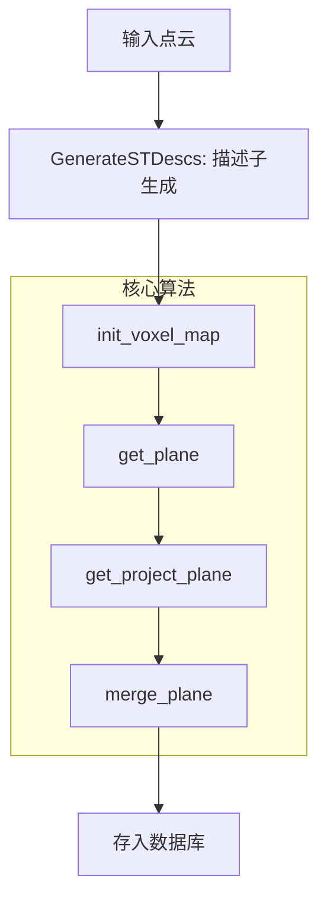

+++
title = 'Hugo 高级可视化指南：代码、公式与流程图'
description = "记录如何在 Hugo 博客中实现 VS Code 级的代码高亮、精美的数学公式以及动态 Mermaid 流程图，打造极致的阅读体验。"
date = '2026-06-30'
draft = false
tags = ['工具']
categories = ['Web']
weight = 1
toc = true
math = true
+++

## 介绍

在技术博客的写作中，如何优雅地展示代码、数学公式和复杂的逻辑流程，直接决定了文章的阅读体验。传统的博客往往受限于静态生成器的默认支持，导致代码高亮生硬、公式解析错误或无法原生支持流程图。

经过一系列的折腾与优化，我总结了一套在 Hugo (PaperMod 主题) 下近乎完美的解决方案：
1. **代码可视化**：摒弃传统的 Chroma/Highlight.js，引入 Shiki，实现与本地 VS Code 完全一致的语法解析与 Dark+ 主题高亮。
2. **数学公式可视化**：集成 KaTeX，实现轻量级、极速的 LaTeX 公式渲染。
3. **流程图可视化**：原生集成 Mermaid.js，用纯文本绘制可交互的架构图与流程图。

本文将详细记录这些特性的实现效果与使用经验。

---

## 代码可视化：VS Code 原生体验 (Shiki)

以前的代码高亮要么颜色不够精确，要么对现代语言（如 C++ 的复杂模板）支持不佳。我们引入了 **Shiki**，它基于 VS Code 原生的 TextMate 语法解析器，能够在网页上 1:1 还原你在编辑器里看到的绝美高亮。

### 核心亮点

- **精准解析**：依靠真实的 AST 语法树和正则，完美区分函数、变量、宏定义。
- **暗黑沉浸**：采用了纯正的 `dark-plus` 主题，加上现代编程等宽字体（JetBrains Mono / Fira Code）。
- **零前端负担**：在线上通过 GitHub Actions 在 Node.js 环境下静态预渲染，浏览器完全不需要加载庞大的 JS 库；而在本地 `hugo server` 模式下，则通过 CDN 动态实时加载 Shiki 引擎，实现所见即所得。

### 演示效果

真正的 C++ 算法代码：

```cpp
// 计算两个描述子的相似度
double binary_similarity(const BinaryDescriptor &b1, const BinaryDescriptor &b2) {
    int same_num = 0;
    for (int i = 0; i < b1.occupy_array_.size(); ++i) {
        if (b1.occupy_array_[i] == b2.occupy_array_[i]) {
            same_num++;
        }
    }
    return (double)same_num / b1.occupy_array_.size();
}
```

*注意：如果是带有大量中文解释的伪代码，请务必使用 `text` 语言标识，以免触发 C++ 语法解析错误。*

```text
平面法向量: n = (A, B, C)
平面中心: c = project_center
3D位置 = py * x_axis + px * y_axis + project_center
```

---

## 数学公式可视化 (KaTeX)

在 SLAM 和算法推导中，数学公式是必不可少的。相比于庞大的 MathJax，**KaTeX** 渲染速度更快，且在移动端排版更美观。

### 使用方法

只需要在 Markdown 文件的开头 Front Matter 中设置 `math = true` 即可启用。

- 行内公式使用一对 `$`，例如：欧拉公式 $e^{i\pi} + 1 = 0$
- 块级公式使用一对 `$$`，自动居中排版：

$$
\min_{\mathbf{T}} \sum_{i} \left\| \mathbf{n}_i^\top (\mathbf{T} \mathbf{p}_i - \mathbf{q}_i) \right\|^2
$$

---

## 流程图可视化 (Mermaid)

文字难以描述复杂的系统架构和算法运行机制，这时候就需要流程图。借助于集成的 **Mermaid.js**，我们可以像写代码一样写图表，而且这些图表支持暗黑模式自动切换。

### 演示效果

只需将代码块的语言标记为 `mermaid` 即可生成如下动态流程图：



由于 Mermaid 是基于纯文本生成的，这也极大地降低了我们后续修改流程图的成本，不需要再用外部软件画图、截图、上传了。

---

## 参考

- **Shiki 官方文档**：https://shiki.style/
- **KaTeX 官网**：https://katex.org/
- **Mermaid 语法大全**：https://mermaid.js.org/
